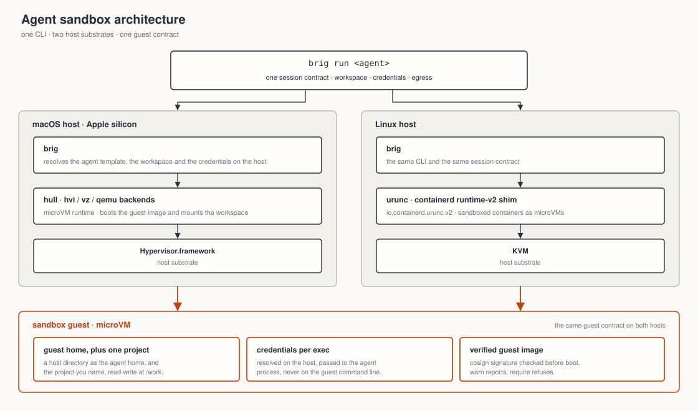

<p align="center">
  <picture>
    <source media="(prefers-color-scheme: dark)" srcset="assets/brig-lockup-on-dark.svg">
    
  </picture>
</p>

**Run a coding agent in a sandbox it cannot escape, with the credentials it
needs and none of the ones it does not.**

## TL;DR

```bash
brew tap brig-sh/brig
brew trust brig-sh/brig       # brew refuses untrusted third-party taps
brew install --cask brig

brig run claude               # boots a sandbox, starts Claude Code in it
```

Put the projects the agent should work on in `~/brig/claude-code`. That
directory is the agent's entire world; the rest of your machine is invisible
to it. The sandbox stays up between commands, so the second `brig run` is
immediate.

<details>
<summary>Building from source, or on Linux</summary>

```bash
git clone https://github.com/brig-sh/brig && cd brig
make build                    # produces ./brig and ./brigd
```

macOS needs `hull` on PATH (see [macOS](#macos) above); Linux needs
`nerdctl`. brig finds either. `cosign` is optional but recommended -- without
it, guest images cannot be verified and brig says so on every boot.
</details>

## macOS

On macOS the sandbox is a microVM, booted by
[hull](https://github.com/brig-sh/hull) over Virtualization.framework. The
Homebrew cask depends on it, so `brew install --cask brig` brings it along.

Building both from source works too:

```bash
git clone https://github.com/brig-sh/hull && cd hull && make build
```

hull ships a `vz-runner` helper that needs the
`com.apple.security.virtualization` entitlement, so a from-source build has to
be signed with a Developer ID certificate to boot a VM. The released build is
signed, notarized and stapled, which is the path to prefer.

On Linux brig drives `nerdctl` over containerd, and hands the container to
the [urunc](https://github.com/urunc-dev/urunc) shim
(`io.containerd.urunc.v2`), so the sandbox is a microVM there too. Point
`BRIG_CONTAINERD_RUNTIME` at `runc` if you want a plain container instead.

## What brig is

`brig` boots an agent CLI -- Claude Code, Codex, and others -- inside a microVM
on macOS or a sandboxed container on Linux, mounts one directory as the agent's home,
and forwards your credentials into it per exec.

<p align="center">
  
</p>

It is not a container runtime, and does not want to be one. It delegates every
mechanical operation -- boot this image, exec in it, stop it -- to `hull` on
macOS and `nerdctl` on Linux, and adds only the four things those tools have
no concept of:

- **Workspace as guest home.** One host directory is the agent's whole world
  and the unit of persistence: its logins, its settings and your projects live
  there and survive a restart.
- **Host-resolved credentials, forwarded per exec.** The guest cannot reach
  your keychain, your secret manager or your SSH agent -- that inaccessibility
  *is* the isolation boundary -- so brig resolves credentials on the host and
  passes them in. Re-read on every exec, so a rotated token needs no restart,
  never written into the workspace, and never placed in a command line where
  `ps` could read it.
- **A billing denylist.** `ANTHROPIC_API_KEY` outranks the OAuth token in
  Claude Code's own precedence, so forwarding it would move a sandbox from
  your subscription onto metered API billing without saying so. It is refused
  by default. Codex gets the same treatment for `OPENAI_API_KEY`.
- **Guest image verification.** Images are checked against the workflow that
  built them before they boot.

Both operating systems run the same library. There is no macOS behaviour and a
separate Linux re-implementation of it.

## Commands

| command | what it does |
| --- | --- |
| `brig run <agent> [args…]` | start the sandbox if needed, then run the agent. Arguments pass through untouched |
| `brig create <agent>` | start the sandbox without attaching; prints its name |
| `brig shell <agent> [cmd…]` | a login shell inside the sandbox, or one command in it |
| `brig exec <agent> -- cmd…` | run one command inside the sandbox |
| `brig stop <agent>` | stop the sandbox, keep it. Starting it again is a boot, not a fresh creation |
| `brig rm <agent>` | stop and remove the sandbox. The workspace is untouched |
| `brig ls` | every brig sandbox, running or merely holding its name, with its workspace |
| `brig reset` | stop and remove every brig sandbox. Workspaces are untouched |
| `brig env <agent>` | what would be forwarded, **by name only**, and whether the guest will be authenticated |
| `brig profiles` | the profiles, their images, and what each one refuses to forward |
| `brig profile ls\|export\|import\|edit\|rm` | manage profiles (`brig export` is the short form of `brig profile export`). `export --json` for JSON instead of YAML |
| `brig secret create\|read\|update\|delete\|ls` | keep secrets in your keyring. macOS only for now |
| `brig version` | |

`brig template …` and `brig agents` are the older spellings and still work
for one release, each printing a one-line note naming the new one; they no
longer appear above. There is deliberately no `brig template edit`.

Flags go before the agent's own arguments; `--` ends brig's parsing outright,
so an agent flag spelled like one of brig's still reaches the agent.

| flag | what it does |
| --- | --- |
| `-n, --name NAME` | a session of its own: own workspace, own sandbox |
| `-t, --image IMAGE` | guest image to boot |
| `-w, --workspace PATH` | host directory to mount as the guest home |
| `-m, --memory MB` | guest memory |
| `--cpus N` | guest vCPUs |
| `-d, --detach` | with `run`: start the sandbox, print its name, exit |

Each flag overrides the corresponding `BRIG_*` setting, which overrides the
profile.

```bash
brig run claude -p "summarise this repo"   # headless, arguments passed through
brig run claude -- --name not-a-session    # --name reaches claude, not brig
brig shell codex 'ls -la ~'                # one command, in a login shell
```

### Named sessions

```bash
brig run claude --name refactor
```

A session of its own: its own workspace (`~/brig/claude-code-refactor`), its
own sandbox, and the name you typed reaches the agent as its display name.

Paths use a short lowercase form of the name -- letters, digits, dot, dash and
underscore, ten characters -- so `my_project` and `my-project` stay separate,
while `Foo` and `foo` do not (macOS filesystems ignore case, and two names
sharing one directory but not one VM is a bug waiting to happen). If the slug
differs from what you typed, brig says which directory it used.
`brig env claude --name refactor` prints the one in use.

**Every other verb needs the same `--name`.** A named session is addressed by
its agent *plus* its name, not by the name alone:

```bash
brig exec claude --name refactor -- git status
brig stop claude --name refactor
brig rm   claude --name refactor      # removes the sandbox, keeps the workspace
```

`brig ls` shows the session as `brig-claude-code-refactor`, but that string is
the sandbox's own name and is not what the verbs take -- `brig rm refactor`
and `brig rm brig-claude-code-refactor` both fail with "unknown agent". Pass
the agent and `--name`, as above.

To drop the workspace too, remove the directory `brig env` prints. And
`brig reset` stops and removes every brig sandbox at once, named ones
included, leaving all workspaces alone.

### If you know Docker Sandboxes (`sbx`)

The verbs line up deliberately, so muscle memory carries over:

| `sbx` | `brig` | note |
| --- | --- | --- |
| `sbx run <agent> [path]` | `brig run <agent> [-w path]` | brig takes the workspace as a flag rather than a positional, so it never has to guess where agent arguments begin |
| `sbx create` | `brig create` | |
| `sbx exec` / `sbx ls` / `sbx stop` / `sbx rm` / `sbx reset` | same | |
| `sbx cp` | n/a | the workspace is a live host directory, so there is nothing to copy across |
| `sbx template ls\|save\|load\|rm` | `brig profile ls\|export\|import\|edit\|rm` | brig's profiles describe the *agent*, not just its image, and are YAML like sbx's kits |
| `sbx secret set` | `BRIG_FORWARD_ENV` + your own secret store | brig resolves nothing itself and stores nothing; whatever puts a value in its environment is enough |
| `sbx -t/--template` | `brig -t/--image` | |
| `sbx -m/--memory`, `--cpus`, `-d`, `--name` | same | |
| `sbx --publish`, `--deny-network` | n/a | not yet; brig does not manage guest networking |
| `sbx --clone` | n/a | not yet; the workspace is mounted directly |
| `sbx login` | n/a | nothing to sign in to |

The deeper differences are the interesting ones. sbx keeps secrets out of the
guest entirely by rewriting auth headers in a host-side proxy; brig forwards
the credential into the guest, because the agent has to be able to use it for
anything other than a proxied HTTP call -- `git push`, a vendor CLI's own
refresh, an MCP server. brig's answer to that exposure is a narrow blast
radius (one workspace, a fine-grained token) rather than a sentinel value.

## Credentials

brig resolves nothing itself: it reads the variables a profile names from its
own environment, so any backend works.

```bash
CLAUDE_CODE_OAUTH_TOKEN=$(your-secret-tool read claude/token) brig run claude
<your secret manager's run-with-env command> -- brig run claude
```

With nothing set, brig falls back to the login already on this Mac, read from
the keychain on every invocation. `BRIG_CREDENTIALS_CMD` points that at any
command printing the same JSON, for any other backend.

Three rules apply to every forwarded variable:

- **Unset or empty is skipped**, so it cannot shadow a value baked into the
  image.
- **A `scheme://` value is refused** -- direnv and friends readily leave a
  secret-manager reference in the environment unresolved, and forwarded
  verbatim it yields "Invalid username or token" in the guest, which looks
  exactly like a broken sandbox. `BRIG_ALLOW_REFS=1` forwards it anyway.
- **A denylisted variable is refused**, with the reason. `BRIG_ALLOW_DENIED=1`
  if metered billing is genuinely what you want.

`brig env <agent>` reports what would be forwarded, by name, and whether the
guest will actually be authenticated -- an expired host token is exactly what
sends a sandbox back to its login screen.

Values reach the runtime through its environment, not its command line, so a
forwarded credential is not readable in `ps`. Inside the sandbox it is
readable by anything running alongside the agent, which is inherent: the
sandbox cannot use a credential it cannot see. Prefer a fine-grained
`GH_TOKEN` scoped to the repositories you want reachable.

### The secret store

`brig secret` is a store of brig's own, for when you have no secret manager to
point the line above at. On macOS it keeps each secret in your login keychain;
there is no Linux backend yet, and brig says so rather than falling back to a
file.

```bash
printf %s "$TOKEN" | brig secret create gh-token   # the value comes from stdin
brig secret create deploy-key -f ~/.ssh/id_ed25519 # ... or from a file, verbatim
brig secret read gh-token
brig secret update gh-token -f -                   # `-` is stdin, spelled out
brig secret ls                                     # names and dates, never values
brig secret delete gh-token                        # asks first; -y answers ahead
```

The value is never an argument, so it stays out of `ps` and out of your shell
history. `create` refuses to overwrite and `update` refuses to create, so a
typo in a name is a message rather than a silently lost secret. `delete` asks
before it removes anything, because nothing keeps a copy of what it removes; a
script says `-y` in advance rather than having the question answered for it.

Nothing forwards these into a sandbox yet -- a profile still names environment
variables, so for now this stores secrets rather than supplying them. What the
keychain does and does not protect is written down in
[docs/security.md](docs/security.md#the-secret-store).

## Guest image verification

Before booting an image, brig asks cosign not "was this signed?" but "was this
built by that workflow, in that repo?" -- the identity is anchored on the
repository *and* the workflow file, so a signature from anywhere else fails.

| situation | what happens |
| --- | --- |
| image under `ghcr.io/brig-sh/`, signature verifies | one line saying so, boots |
| image published by someone else | **warning**, boots. Bring-your-own images are a supported way to use brig |
| `cosign` not installed | **warning**, boots. "Could not check" is not "failed" |
| image under `ghcr.io/brig-sh/`, signature does **not** verify | **stops and asks** `[y/N]`. With no terminal it refuses |

`BRIG_VERIFY=require` refuses anything that cannot be positively verified,
third-party images included. `BRIG_VERIFY=off` skips the check.
[docs/security.md](docs/security.md) explains the reasoning, and what brig does
not protect you from.

Two limitations worth knowing: under the default `missing` pull policy cosign
verifies the tag in the registry, not necessarily the copy already in your
local store; and `claude-desktop` and `ubuntu` still point at
`ghcr.io/nofireai/` images, so they warn on every boot until those move.

### Image tags

The five published agents default to `:latest`, a multi-arch index covering
`linux/arm64` and `linux/amd64`. One reference is therefore right on an Apple
Silicon Mac and on an x86 Linux host -- the runtime resolves the index and
pulls the matching manifest.

| tag | what it is |
| --- | --- |
| `:latest` | multi-arch index, arm64 + amd64. What the profiles use |
| `:arm64`, `:amd64` | one architecture |
| `:<arch>-<sha>` | immutable pin: that architecture, that build, permanently |

All of them are signed the same way and verify with the same command.

`:latest` moves when a new image is published, and under the default `missing`
pull policy a cached tag is never re-resolved -- so a republished image stays
invisible until you set `BRIG_PULL=always` or clear the store. When you want a
guest that cannot move under you, pin the build:

```bash
brig run claude --image ghcr.io/brig-sh/claude-code:arm64-98f4739
```

`cursor` is built by community-images but deliberately not published, pending
a terms check. `brig run cursor` says so rather than failing on a registry
404; build the image yourself and pass `--image`.

## Documentation

The README is the overview. The details live in [docs/](docs/):

- [profiles.md](docs/profiles.md) -- writing an agent profile, field by field
- [security.md](docs/security.md) -- what the boundary is, and what it is not
- [brigd.md](docs/brigd.md) -- the session daemon and its protocol

## Custom agents and your own images

Any Linux CLI in an OCI image already runs under brig. A profile just saves
you spelling out the image, the guest home and the credential variables every
time:

```bash
brig profile export claude-code mine   # start from the closest one
brig profile edit mine                 # change name, image, forward/deny
brig run mine
```

The second word is a name, not a path: brig writes `~/.config/brig/mine.yaml`,
which is where a profile file has to be for brig to read it back. Export
writes that directory and nowhere else, so a path is refused rather than
honoured -- redirect stdout (`brig profile export claude-code > mine.yaml`)
if you want a copy of your own. It also refuses to overwrite an existing file
unless you pass `--force`, since an export is generated bytes and the file it
would replace is not.

Profiles are **YAML or JSON** -- JSON is a subset of YAML, so one parser reads
both and nothing has to guess. Export writes YAML, because a profile is a
file a person edits and YAML has comments; the exported file carries a header
explaining every field. `brig profile export --json` for anything consuming
profiles programmatically.

An imported file is stored byte for byte as you wrote it, so your comments and
your ordering survive:

```yaml
# A brig profile. Edit it, then: brig profile import <this file>
# ...
name: mine
image: docker.io/me/mine:latest
guestHome: /home/mine
binary: mine
forward: [GH_TOKEN]      # inline lists work too
mem: 8192                # this CLI is a memory hog
cpus: 2
```

A misspelled field is refused rather than ignored -- `forwards:` would
otherwise decode into nothing and forward no credentials, which looks exactly
like a broken sandbox.

A custom profile may take a built-in's name -- that is how you pin your own
image for an agent brig already knows about. `brig profiles` marks those
`(file, overrides built-in)`. Your own live in `$XDG_CONFIG_HOME/brig`
(default `~/.config/brig`), one file each; the directory starts empty and
brig never writes there unless you ask it to.

[docs/profiles.md](docs/profiles.md) walks through the fields with a worked
example. Building an image for one is documented in
[community-images/docs/bring-your-own-image.md](https://github.com/brig-sh/community-images/blob/main/docs/bring-your-own-image.md).

## Git in the guest

```bash
BRIG_GIT_CONFIG=1 brig run claude
```

Off by default, because turning it on writes two files into your workspace: a
credential helper that reads `GH_TOKEN` from the guest environment, and a
gitconfig that rewrites SSH GitHub remotes to HTTPS (the guest has no SSH
agent, so SSH remotes cannot work there). Neither file holds a secret. Set
your login once with `git config --global github.user <login>`.

Your commit identity is forwarded as environment, resolved from the directory
you invoked brig in, so per-directory `includeIf` rules carry into the guest.
Guest commits are unsigned: signing needs a host-side agent the guest cannot
reach.

`GIT_TERMINAL_PROMPT=0` is forwarded unconditionally -- inside an agent session
there is nobody to answer a credential prompt, so git would simply hang.

## Environment variables

Every setting is read in this order, first hit wins:

```
BRIG_<AGENT>_<KEY>   →   BRIG_<KEY>
```

`<AGENT>` is the profile name uppercased with dashes as underscores
(`BRIG_CLAUDE_CODE_WORKSPACE`), so one shell can carry different settings for
two agents.

Booleans are shell-style: anything except `0` is on.

### Where things live

| variable | default | what it does |
| --- | --- | --- |
| `BRIG_WORKSPACE` | `~/brig/<agent>` | Host directory mounted as the guest home. A named session appends `-<slug>` |
| `BRIG_NAME` | `brig-<agent>` | Sandbox (VM or container) name. A named session appends `-<slug>` |
| `BRIG_PROFILE_DIR` | `~/.config/brig` | Where custom profiles are read from and written to (`BRIG_TEMPLATE_DIR` still works) |

### Image and guest

| variable | default | what it does |
| --- | --- | --- |
| `BRIG_IMAGE` | per profile | Guest image to boot |
| `BRIG_PULL` | `missing` | `missing`, `always` or `never`. A cached tag is not re-resolved, so a republished moving tag stays invisible until you say `always` |
| `BRIG_MEM` | per profile (4096) | Guest memory, MB |
| `BRIG_CPUS` | per profile (4) | Guest vCPUs |
| `BRIG_READY_TIMEOUT` | `30` | Seconds to wait for the in-guest agent after the runtime reports the sandbox running. The two are not the same moment |
| `BRIG_TITLE` | per profile | Window title, for a graphical agent |

### Credentials

| variable | default | what it does |
| --- | --- | --- |
| `BRIG_FORWARD_ENV` | per profile | Space-separated list of variables to forward. Replaces the profile's list rather than adding to it |
| `BRIG_CREDENTIALS_CMD` | (keychain) | Command printing the host credential JSON on stdout. Any backend: `op read`, `vault kv get`, a script |
| `BRIG_ALLOW_REFS` | `0` | Forward a value that looks like an unresolved `scheme://` secret reference |
| `BRIG_ALLOW_DENIED` | `0` | Forward a variable on the profile's billing denylist |
| `GIT_TERMINAL_PROMPT` | `0` | Forwarded as-is; set it to `1` on the host to let git prompt in the guest |

### Guest git

| variable | default | what it does |
| --- | --- | --- |
| `BRIG_GIT_CONFIG` | `0` | Write the credential helper and gitconfig into the workspace, routing SSH GitHub remotes over HTTPS |
| `BRIG_GIT_HOSTS` | `github.com` | Space-separated hosts the token applies to |
| `BRIG_GIT_USER` | `github.user`, then gh's record, then `x-access-token` | Username paired with the forwarded token |
| `BRIG_GIT_IDENTITY` | `1` | Forward the host commit identity, resolved from the invoking directory |
| `BRIG_GIT_NAME`, `BRIG_GIT_EMAIL` | host git config | Override that identity |

### Trust and verification

| variable | default | what it does |
| --- | --- | --- |
| `BRIG_TRUST_WORKSPACE` | `1` | Pre-answer the agent's "do you trust the files in this folder?" for the directory each run starts in. The guest sees only the workspace, so mounting it already answered that question |
| `BRIG_VERIFY` | `warn` | `warn`, `require` or `off` -- see the table above |
| `BRIG_VERIFY_REGISTRY` | `ghcr.io/brig-sh/` | Image prefix treated as "ours", so a check is expected |
| `BRIG_VERIFY_IDENTITY` | community-images workflow | Certificate identity regexp cosign must match |
| `BRIG_VERIFY_ISSUER` | GitHub Actions OIDC | Certificate OIDC issuer |
| `BRIG_COSIGN_BIN` | `cosign` | Path to cosign |

### Runtime

| variable | default | what it does |
| --- | --- | --- |
| `BRIG_RUNTIME` | `hull` on macOS, `nerdctl` elsewhere | Which backend to drive |
| `BRIG_RUNTIME_BIN` | first of `hull` / `nerdctl`, `docker` on PATH | Path to that binary |
| `BRIG_HYPERVISOR` | `vz` | Hypervisor backend, macOS only: `vz`, `hvi` or `qemu`. Only `vz` has a graphical console, so a GUI profile is refused on the others |
| `BRIG_GATEWAY_SOCK` | `~/.brig/gateway.sock` | Control socket of the user-mode network gateway. `hvi` has no egress without one, so brig starts a shared gateway there and joins every sandbox to it |
| `BRIG_BOOT_ASSETS` | whatever `hull assets dir` reports on macOS, `$XDG_DATA_HOME/brig/assets` (default `~/.local/share/brig/assets`) on Linux | Directory holding the host kernel and `container-initrd` used to boot a profile marked `genericBoot`. The kernel is named `Image` on arm64 and `bzImage` on x86_64. Set it and brig uses what is there, unchanged; leave it unset and brig downloads the pair on first use (hull on macOS, `oras` on Linux) |
| `BRIG_BOOT_ASSETS_REF` | `ghcr.io/nofireai/hull-assets:<os>-<arch>` | The bundle brig fetches when the boot assets are missing. Override to pin a version or use a mirror |
| `BRIG_ROOTFS_TYPE` | profile's `rootfsType` | How the guest root reaches the VM: `block`, `virtiofs` or `9pfs` |
| `BRIG_ENV_ARGV` | `0` | Put forwarded values back on the runtime's command line, where `ps` can read them. For a runtime build that does not accept a bare `--env KEY`. Opt-in, and it costs you the `ps` guarantee |
| `DO_NOT_TRACK`, `HULL_TELEMETRY_DISABLED` | | Passed through to the runtime untouched, and always win |


## brigd

`brigd` keeps the session inventory and is the single owner of boot and
teardown when several callers want the same sandbox, over the same library the
CLI uses. Line-delimited JSON on a unix socket:

```json
{"op":"ensure","agent":"claude-code","name":"refactor"}
{"op":"status"}
{"op":"stop","agent":"claude-code","name":"refactor"}
```

It does not proxy exec. Handing your terminal to a process inside the guest
means passing file descriptors, and `brig exec` already does that correctly by
replacing itself with the runtime. The daemon owns lifecycle, the CLI owns the
terminal. See [docs/brigd.md](docs/brigd.md).

## Agents

Profiles are data ([internal/profile](internal/profile/profile.go)): a binary,
the variables carrying its credentials, the ones denied for billing safety,
the state paths, and an image. The eight built-in specs live in
[internal/profile/specs](internal/profile/specs/) and are embedded in the
binary, so brig works with no setup at all. Guest images live in
[brig-sh/community-images](https://github.com/brig-sh/community-images) with
open Dockerfiles, and a profile name is the same string as its image name.

Claude Code and Codex are the proven core. Gemini, Grok and opencode are
example profiles. `claude-desktop` is the GUI app in a windowed VM, and
`ubuntu` is a plain root shell for when you need to inspect guest networking
or raise a raw socket.

## Verifying a brig download

Releases are signed with keyless cosign -- no key to distribute, none for us to
lose:

```bash
cosign verify-blob \
  --certificate checksums.txt.pem \
  --signature checksums.txt.sig \
  --certificate-identity-regexp \
    '^https://github.com/brig-sh/brig/.github/workflows/release.yml@refs/tags/' \
  --certificate-oidc-issuer https://token.actions.githubusercontent.com \
  checksums.txt

shasum -a 256 -c checksums.txt --ignore-missing
```

The macOS binaries are also signed with a Developer ID certificate and
notarized with Apple, so Gatekeeper accepts them without any quarantine
fiddling. Each archive ships an SPDX SBOM.

## Not yet ported

- **Workspace clone/overlay and explicit-apply.** The workspace is mounted
  directly, so an agent works on your files rather than on a private copy it
  later applies.

## License

Apache-2.0, see [LICENSE](LICENSE). That covers brig itself. The agent CLIs it
runs, and the guest images they come in, are each under their own terms.

---

<p align="center">
  <a href="https://nofire.ai">
    <picture>
      <source media="(prefers-color-scheme: dark)" srcset="assets/nofire-logo-on-dark.svg">
      
    </picture>
  </a>
</p>

<p align="center">Powered by <a href="https://nofire.ai">NOFire AI</a></p>
