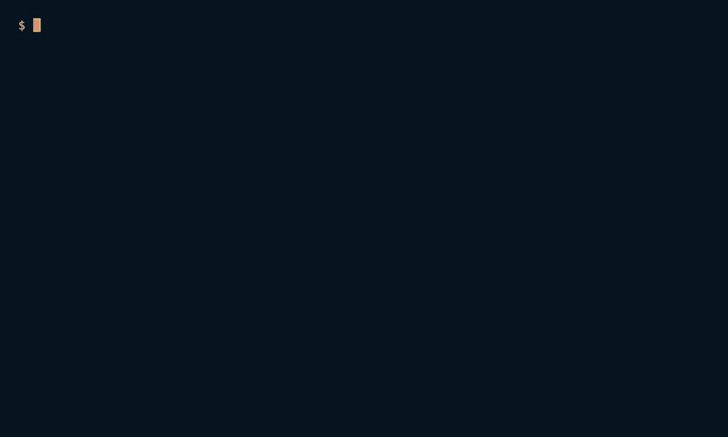

<p align="center">
  <picture>
    <source media="(prefers-color-scheme: dark)" srcset="assets/brig-lockup-on-dark.svg">
    
  </picture>
</p>

<p align="center">
  <a href="https://github.com/brig-sh/brig/releases/latest"></a>
  <a href="https://github.com/brig-sh/brig/actions/workflows/ci.yml"></a>
  <a href="https://codecov.io/gh/brig-sh/brig"></a>
  <a href="go.mod"></a>
  <a href="LICENSE"></a>
</p>

**Brig runs a coding agent inside a microVM on your own machine.**

A microVM is a small virtual machine with its own kernel. The agent inside it
sees one project directory you name and a home directory of its own. It does
not see the rest of your disk, your keychain or your SSH agent. A bad edit or a
bad command reaches no further than that project, and you can delete the
sandbox when you are done.

<p align="center">
  
</p>

## When to use it

Use Brig when you want to:

- leave an agent such as Claude Code or Codex working unattended on one
  repository;
- run an agent, or any Linux CLI in an OCI image, and choose by name which
  credentials it gets;
- keep several independent agent sessions on one machine.

Brig does not run sandboxes on a remote host or a cluster, does not run on
Windows or Intel Macs, and does not stop an agent from sending out what it can
read unless you bind an egress policy. [docs/non-goals.md](docs/non-goals.md)
lists what Brig will not do, and [docs/security.md](docs/security.md) lists
what the sandbox does not protect.

## How it works

One command starts a sandbox and runs the agent in it:

```bash
brig run claude ~/code/demo
```

`claude` in that command is a session ref, the name every Brig command
takes. A ref is `<agent>` or `<agent>@<label>`, so `claude` and
`claude@refactor` are two independent sessions of one agent, each with its
own sandbox.

Brig does not boot the virtual machine itself. It drives a runtime:
[hull](https://github.com/brig-sh/hull) on macOS, and `nerdctl` with the
`urunc` shim on Linux. On top of the runtime, Brig adds four things:

- **A guest home and a project mount.** The guest home is a host directory
  mounted as the agent's home. It holds the agent's settings and history.
  Brig creates one per session and `brig rm` deletes it. Pass `--home <dir>`
  to use a directory of your own, which Brig never deletes. The project you
  name on the run line is mounted read-write at `/work/<name>`, and the agent
  starts there.
- **Credentials forwarded by name.** The guest cannot read your keychain, so
  Brig resolves each credential on the host and passes it in. It forwards
  only what the agent's profile names. The built-in profiles name `GH_TOKEN`,
  so a `GH_TOKEN` exported in your shell reaches the guest. With nothing
  exported or stored, the agent starts logged out and asks you to log in.
  `brig info <ref>` lists what a run forwards, by name.
- **A billing denylist.** A profile can name variables Brig does not forward
  unless you set `BRIG_ALLOW_DENIED=1`. `claude-code` denies
  `ANTHROPIC_API_KEY`, because forwarding it would move the agent from your
  subscription to metered billing.
- **Image verification.** Brig checks the signature of the guest images and
  boot assets that brig-sh publishes. An image from anywhere else has no
  signature to check, and Brig says so before it boots.

[docs/sessions.md](docs/sessions.md) describes sessions, homes and projects in
full.

## Requirements

| Host | Supported |
| --- | --- |
| Mac, Apple silicon, macOS 15 or newer | Yes |
| Mac, Apple silicon, macOS 14 | Yes, with `BRIG_HYPERVISOR=vz BRIG_NETWORK=shared` |
| Intel Mac | No |
| Linux, x86-64 or arm64 | Yes, with the runtime bundle `install.sh` installs |

Six of the eight built-in agents use hull's `hvi` backend, which needs
macOS 15. [docs/install.md#platform-support](docs/install.md#platform-support)
has the details.

To run Claude Code you also need an Anthropic account to log in with. The
`ubuntu` agent needs no account, so you can use it to try Brig without one.

## Install

On macOS, with [Homebrew](https://brew.sh):

```bash
brew tap brig-sh/brig
brew trust brig-sh/brig
brew install --cask brig
```

The cask installs `brig`, `brigd`, [hull](https://github.com/brig-sh/hull) and
`cosign`. For Linux, `install.sh` or a source build, see
[docs/install.md](docs/install.md).

## First run

Check the host first:

```bash
brig doctor
```

Each line is one check, marked `ok`, `!!` or `--`. A `!!` line prints its fix
under it. `!!` beside `boot` is normal before the first run, because Brig
fetches the boot assets when an agent first needs them.

Then run an agent on a throwaway project:

```bash
mkdir -p ~/code/demo
brig run claude ~/code/demo
```

The first run downloads the guest image and the boot assets, so it takes
longer than later runs. Brig then prints

```
brig: image and boot assets verified
```

and Claude Code asks you to log in inside the sandbox. Inside the agent, `pwd`
prints `/work/demo`. [docs/authentication.md](docs/authentication.md) covers
the login and how to reuse one from the host.

To try Brig without an account, run the `ubuntu` agent instead. It opens a
root shell in `/work/demo`. Its image is not published by brig-sh, so Brig
prints a note that it has no signature to check, then
`brig: boot assets verified`:

```bash
brig run ubuntu ~/code/demo
```

While the sandbox runs, you can open one of its ports on the host:

```bash
brig network publish claude 3000   # the agent's dev server, on localhost:3000
```

A published port binds to `127.0.0.1` unless you give another address. On
Linux, nerdctl fixes a sandbox's ports when it creates it, so name the port
on the run line instead: `brig run claude ~/code/demo --publish 3000`.

When you are done:

```bash
brig stop claude                   # stop the sandbox, keep the session
brig rm claude                     # stop it, remove it, delete its guest home
```

If you ran `ubuntu`, remove it the same way: `brig rm ubuntu`. No command
here touches `~/code/demo`.
[docs/quickstart.md](docs/quickstart.md) walks through the same steps with
the output of each.

## What the agent can reach

<p align="center">
  
</p>

- **Your project.** The project mount is read-write, and those are your real
  files. The agent can change or delete anything under it.
- **The internet.** A new sandbox on `hvi` or Linux gets an `isolated` network
  of its own, which keeps it off other sandboxes' networks. It still reaches the
  internet, so anything the agent can read it can also send. The `vz` profiles
  use a `shared` network. An existing sandbox keeps the network it was created
  with. See [Network postures](docs/policies.md#network-postures).
- **Egress policy.** A policy restricts what the guest can reach. Brig
  enforces one on hull's `hvi` backend and on Linux with nerdctl, and refuses
  a policy-bound run on any other backend. See [docs/policies.md](docs/policies.md).
- **Unverified images.** Image verification defaults to `warn`: Brig reports
  an image it cannot verify and boots it anyway. Set `BRIG_VERIFY=require` to
  refuse one.

[docs/security.md](docs/security.md) states each limit in full.

## Documentation

| If you want to | Read |
| --- | --- |
| Install Brig on any supported host | [docs/install.md](docs/install.md) |
| Get a first agent running, step by step | [docs/quickstart.md](docs/quickstart.md) |
| Understand homes, projects and sessions | [docs/sessions.md](docs/sessions.md) |
| Log an agent in, or give it Git access | [docs/authentication.md](docs/authentication.md), [docs/secrets.md](docs/secrets.md) |
| Look up a command, a flag or a variable | [docs/cli.md](docs/cli.md) |
| Run your own agent or your own image | [docs/profiles.md](docs/profiles.md), [docs/guest-image.md](docs/guest-image.md) |
| Restrict what the guest can reach | [docs/policies.md](docs/policies.md) |
| Understand the isolation, and its limits | [docs/security.md](docs/security.md) |
| Know what Brig counts, and turn it off | [docs/telemetry.md](docs/telemetry.md) |
| Fix something that went wrong | [docs/troubleshooting.md](docs/troubleshooting.md) |
| Move off a retired command spelling | [docs/migration.md](docs/migration.md) |
| Know what is stable and what is not | [docs/stability.md](docs/stability.md) |

The full index is [docs/README.md](docs/README.md).

## Project status

Brig has not reached 1.0, and a minor release can make breaking changes.
`brig version` prints the version you have.
[docs/stability.md](docs/stability.md) lists what you can script against
today.

- Questions and bugs: [docs/support.md](docs/support.md).
- Vulnerabilities: [SECURITY.md](SECURITY.md), never a public issue.
- Contributing: [CONTRIBUTING.md](CONTRIBUTING.md) covers the build, the
  tests and the review norms. [AI_POLICY.md](AI_POLICY.md) covers
  AI-assisted contributions.
- License: Apache License 2.0. See [LICENSE](LICENSE).

Brig itself counts nothing. On macOS the hull runtime it drives counts a
few events, and on Linux nothing is sent. `brig telemetry status` shows the
current setting, and `brig telemetry off` turns it off.
[docs/telemetry.md](docs/telemetry.md) has the field-by-field detail.

<p align="center">
  <picture>
    <source media="(prefers-color-scheme: dark)" srcset="assets/nofire-logo-on-dark.svg">
    
  </picture>
</p>
