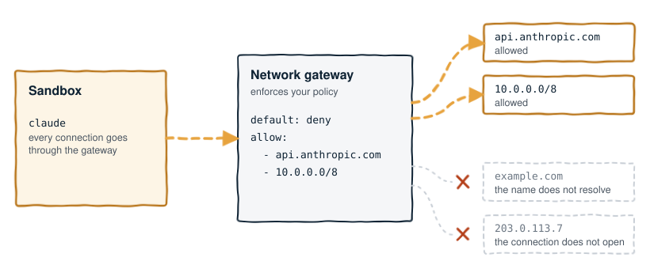

# Networking and egress policy

You control what a sandbox reaches in two ways. A network posture sets which
network the sandbox is on. An egress policy sets what the agent can reach
outbound, and you bind it to a profile or to one session.

## Quick example

A complete policy:

```yaml
apiVersion: brig.sh/v1alpha1
name: locked-down
desc: only Anthropic's API and one internal range
egress:
  default: deny
  allow:
    - host: api.anthropic.com
    - cidr: 10.0.0.0/8
```

<p align="center">
  
</p>

The diagram shows hull's `hvi` backend, where the sandbox's network gateway
enforces the policy. For Linux, see
[How nerdctl enforces a policy](#how-nerdctl-enforces-a-policy).

Create the policy, attach it to a profile, and run the agent:

```bash
brig policy create locked-down   # writes ~/.config/brig/policies/locked-down.yaml
brig policy attach locked-down claude-code
brig run claude
```

`brig policy create` writes a starter document and opens it in your editor.
Fill it in as shown above.

> [!NOTE]
> Not every run path enforces a policy. See
> [Where a policy is enforced, and where it is not](#where-a-policy-is-enforced-and-where-it-is-not).

## Network postures

Every sandbox runs under one of three postures:

| posture | what it permits |
| --- | --- |
| `shared` | one network for every sandbox using this posture on the host. Opt-in, except for the `vz` profiles and retained older sessions |
| `isolated` | a network of this sandbox's own. The default for new `hvi` and Linux sandboxes |
| `offline` | no route out. The agent runs, the guest home is mounted, nothing leaves |

```bash
brig run claude                         # a new sandbox gets its own network
brig run claude@shared --network shared # explicitly share one with other sandboxes
```

Both `shared` and `isolated` permit internet access. Isolation separates
sandboxes. It does not apply an outbound allow list, and it does not promise
that host services are unreachable. An egress policy is a separate choice.

Sandboxes on `shared` reach each other on `hvi` and on Linux. `vz` is not
measured on a current hull. `--network isolated` keeps a sandbox off that
network. For the measurements, see the table for each backend in
[Things Brig does not claim](security.md#things-brig-does-not-claim).

### Set a posture

Brig uses the first posture that it finds in this order:

1. The `--network` flag.
2. The `BRIG_NETWORK` setting.
3. The posture that the sandbox was started with.
4. The `network:` field of the profile.
5. The default for the backend.

Brig refuses a run with an unrecognized value, and names where the value
came from:

```console
$ BRIG_NETWORK=bogus brig info claude-code
brig: BRIG_NETWORK "bogus" is not a posture: use shared, isolated or offline
```

### Posture by backend and profile

A new sandbox gets `isolated` on `hvi` and on Linux. On macOS, `isolated`
needs the `hvi` backend.

| Case | Posture |
| --- | --- |
| A new sandbox on `hvi` or Linux | `isolated`. On Linux, nerdctl creates a network for each sandbox |
| The six built-in `hvi` profiles | `isolated`. Each profile names that posture |
| `claude-desktop` | `shared`. The profile names that posture, because its GUI requires `vz`, where Brig cannot give a sandbox its own network |
| The unpublished `cursor` profile | The profile names no posture. It gets `isolated` on Linux and `hvi`, and the `shared` fallback on `vz` and `qemu` |
| A custom profile with no `network:` field, on `vz` or `qemu` | `shared`, only when no flag, environment setting or retained posture names a network. The `NETWORK` row in `brig info` names that backend fallback |
| An explicit `isolated`, such as `--network isolated`, on `vz` or `qemu` | Refused. `vz` and `qemu` take their network from vmnet, which Brig does not own |
| A built-in `hvi` profile overridden to `vz` or `qemu` | Needs `--network shared` or `BRIG_NETWORK=shared`, because the profile asks for isolation |

On `hvi`, isolation costs one gateway process for each sandbox. One gateway
used about 28.7 MB in the measurement recorded in
[#369](https://github.com/brig-sh/brig/issues/369). That number is not a
fixed resource guarantee. The isolated address pool has 64 networks, and
Brig refuses another boot when the pool is empty. To free the networks of
unused sandboxes, remove them with `brig rm <ref>`. Linux uses the network
allocation of the runtime, and it does not use this pool.

### Read the posture

`brig info` prints the posture as one of these three lines:

```
NETWORK      shared (one network for every sandbox on this host)
NETWORK      isolated (a network of this sandbox's own)
NETWORK      offline (no egress)
```

The row names the posture that the running sandbox has. When the next boot
gets a different posture, the row names that posture too. This occurs, for
example, after you attach or detach a policy:

```
NETWORK      isolated (a network of this sandbox's own); shared from its next boot
```

### Change the posture

A sandbox keeps the posture that it was started with. A later command that
names no posture uses that posture. Examples are `brig sh`, `brig info` and
a bare `brig run`. The `network:` field of the profile does not change it.

To change the posture, name a different one with `--network` or
`BRIG_NETWORK`. The posture is fixed when a sandbox boots, so Brig restarts
the sandbox. Brig says which posture the sandbox leaves and which posture it
goes to:

```console
$ brig run claude --network shared
brig: this sandbox was started with the isolated posture and --network asks for shared
  ↳ rules are fixed when a sandbox boots, so brig restarts it
  ↳ any other session using this sandbox will be disconnected
```

Brig records the posture when it boots a sandbox, and `brig rm` drops the
record.

### Postures and policies

An egress policy bound to a sandbox forces the `isolated` posture, whether
or not `--network` asked for it. The record keeps the posture that you asked
for, so the sandbox goes back to that posture after you detach the policy.
Until the next boot, `brig info` names `isolated`, which is the posture that
the sandbox runs with.

To keep `isolated` after a detach, ask for it with `--network isolated`
while the policy is attached. Brig restarts the sandbox to record that
posture.

<details>
<summary>Sessions with no posture record, and other rare cases</summary>

**Recovery from the runtime.** For an existing session with no record, Brig
asks the runtime how the sandbox was configured. If Brig can recover that
configuration, it keeps that posture ahead of the default of the profile.
A read of the posture does not write a record and does not restart the
sandbox. A successful run that reuses the sandbox records the recovered
posture for later commands.

**Reserved socket names.** The name `sandbox-*.sock`, including case
variants, is reserved for isolated gateways. Brig rejects a shared
`BRIG_GATEWAY_SOCK` override with that name before it starts or replaces a
networked guest.

For an unrecorded hull guest, Brig looks at the gateway socket path in the
saved argv of hull:

| Gateway socket | Recovered posture |
| --- | --- |
| `sandbox-*.sock`, with a readable, nonempty `.spec` beside the socket path | `isolated`, even under a previous gateway directory. Only isolated gateways write that file |
| `sandbox-*.sock`, with a missing, empty or unreadable `.spec` | `unknown`. Brig refuses a run that names no posture |
| any other name | `shared` |

The current gateway environment does not choose which spec Brig reads.

A missing spec does not prove shared networking. `brig stop` removes the
spec, and the gateway writes it at startup on a best-effort basis. As a
result, an older isolated guest that was stopped before Brig recorded
postures needs an explicit network choice.

The spec records the configuration of the gateway. It does not identify the
creation of a VM. Older versions allowed shared overrides named
`sandbox-*.sock`. If such an override reuses an old isolated socket path
that has a leftover spec, this recovery can wrongly report isolation.

**Changed gateway settings.** If you change `BRIG_GATEWAY_DIR`, you also
change where Brig reads `networks.json` and the allocator records. The same
applies to the directory of `BRIG_GATEWAY_SOCK` when no gateway directory is
set. To find those records, restore the original settings. If the recovered
configuration cannot be reused, choose a network explicitly to recreate the
guest. Before you recreate a shared guest, choose a shared socket name that
is not reserved.

The recovery of a posture does not reconstruct lost allocator or gateway
records. If a recovered posture does not pass the current gateway
consistency check, a run that names no posture refuses to replace the guest.
Restore the gateway settings of the guest, or name `--network` explicitly.
The normal consistency checks also apply to sandboxes with a saved posture
record.

**Unknown posture.** If Brig cannot establish the posture of an existing
sandbox, it refuses a run that names no posture. It does not apply the new
default. If no runtime can inspect the sandbox, `brig info` reports the
posture as unknown. To recreate the sandbox, name the posture with
`--network` or `BRIG_NETWORK`. That disconnects any session that uses the
sandbox. A sandbox that the runtime confirms is absent uses the defaults for
a new sandbox.

**Legacy hull sessions.** The `inspect` command of hull cannot distinguish
an absent VM from unreadable metadata, and its listing omits unreadable
records. As a result, Brig keeps an indexed legacy session unknown even when
hull says "instance not found". If you removed the VM directly with
`hull rm`, you have three options:

- `brig ls` prunes the stale session entry.
- `brig rm <ref>` forgets the session.
- You can also name the intended posture explicitly.

For an unexplained error, check runtime access and saved state before you
use one of these options. If all session-index evidence is also lost, hull
cannot distinguish that case from a new name. Then the ordinary discovery of
Brig uses the default for a new sandbox.

**Two releases on one host.** An older release that boots the sandbox again
does not update the record. On a host where two releases share one sandbox,
the record can name a posture that the sandbox no longer has. `brig info`
reports the recorded posture. There is one exception: on `hvi`, when the
record says `shared` and the sandbox is behind an isolated gateway,
`brig info` names `isolated`. A `brig stop` and a `brig run` from the
current release boot the sandbox again and write a new record. `brig rm`
drops the record with the sandbox. It also drops the record with the session
when the sandbox was already removed outside Brig.

</details>

## Write a policy

A policy is a named YAML (or JSON) document that declares what an agent can
reach outbound. It sets a default of `allow` or `deny`, and `host` or `cidr`
exceptions on either side. `brig policy create` writes a starter and opens
it in your editor, the same way `brig agent edit` does:

```bash
brig policy create locked-down   # writes ~/.config/brig/policies/locked-down.yaml
brig policy edit locked-down     # change the rules
```

## Where policies live

Brig keeps one file for each policy in a flat directory, for example
`~/.config/brig/policies/locked-down.yaml`.

| Setting | Policy directory |
| --- | --- |
| default | `~/.config/brig/policies` |
| `$XDG_CONFIG_HOME` | `$XDG_CONFIG_HOME/brig/policies` |
| `BRIG_POLICY_DIR` | the value as given, relative or not. It overrides the other two |

An empty or relative `$XDG_CONFIG_HOME` counts as unset, as the
[XDG Base Directory Specification, version 0.8](https://specifications.freedesktop.org/basedir/latest/)
requires.

The directory starts empty. Brig writes there only when you run `brig
policy create`, `edit`, `rm`, `attach` or `detach`.

`name:` inside the file wins over the filename, as it does for a profile.
`create` always gives the file the name of the policy, but a file with a
different name is valid. A directory can hold any number of policies.

One file that fails to parse does not stop the other files from loading.
`brig policy ls` reports that file on stderr and lists every policy that did
load. It reports two files that declare the same name in the same way.

## Policy fields

The [quick example](#quick-example) shows a complete document.

| field | required | what it is |
| --- | --- | --- |
| `apiVersion` | yes | Pins the document shape. `brig.sh/v1alpha1` is the only value this build knows. Anything else is refused |
| `name` | yes | The policy's identifier. Wins over the filename, and follows the same character rule as a profile name. See [Naming a policy](#naming-a-policy) |
| `desc` | no | One line, shown by `brig policy ls` |
| `egress.default` | yes | `allow` or `deny`, applied to any traffic neither list below names |
| `egress.allow` | no | Exceptions to a `deny` default |
| `egress.deny` | no | A host or range to refuse regardless. At the gateway that enforces the rules, `deny` takes priority over `allow` and over `default`. Brig applies no priority: it passes every rule through as a flag. See [Where a policy is enforced](#where-a-policy-is-enforced-and-where-it-is-not) |

Each entry in `allow` or `deny` names one of `host:` or `cidr:`. Brig
refuses an entry that names both, and an entry that names neither.

| Key | Value | What Brig checks |
| --- | --- | --- |
| `host:` | a domain, or a glob such as `"*.githubusercontent.com"` | Brig refuses a host only for whitespace or a control character |
| `cidr:` | a network range such as `10.0.0.0/8` | Brig checks it with Go's `net.ParseCIDR`. It refuses a typo such as `10.0.0/8` (an octet short), which cannot then reach the gateway as a rule that matches nothing |

Brig does not hold `host:` to a glob grammar. The enforcer decides which
wildcard forms it honors. The gateway that enforces a policy today matches
the glob against the name that the guest asks its resolver for.

Parsing is strict. A field that the format does not recognize fails to
parse. Examples are `engine:`, `mode:`, and a typo such as `dsc:`. The
format has no field that names how a rule is applied.

## Naming a policy

A policy name follows the same character rule as a profile name: lowercase
letters, digits, dot, dash and underscore, starting with a letter or digit.
Brig checks the name before it builds a path from it, so a bad name never
reaches disk.

One rule applies only to policies. A bare word such as `no`, `true` or `123`
is inside that character set, but unquoted YAML reads it as a boolean or a
number. A policy named `no` gets the name `false`, and you cannot reach it
by the name that you gave it. `brig policy create` writes the name the way
the starter template writes it and reads the result back. It refuses a name
that does not come back as itself:

```console
$ brig policy create no
brig: name "no" reads as false when written unquoted in YAML, not as itself; pick a different name
```

## Commands

| verb | what it does |
| --- | --- |
| `brig policy ls` | every policy that parses, by name and description, and, for one bound to anything, what binds it |
| `brig policy create <name> [--force]` | write a starter document, then open it: `$VISUAL`, then `$EDITOR`, then `vi` |
| `brig policy edit <name> [--force]` | open an existing one, and only replace it if the save still parses and validates. Refuses a rename that orphans anything bound to it, inline or attached, unless `--force` |
| `brig policy show <name> [--json]` | print the parsed document |
| `brig policy rm <name> [--force]` | delete it. Refuses one that is bound to anything, inline or attached, unless `--force` |
| `brig policy attach <policy> <profile> [-n NAME]` | bind it to every run of a profile, or, with `-n`, to one session by name instead |
| `brig policy detach <policy> <profile> [-n NAME]` | reverse an attach |
| `brig policy check <profile> [-n NAME]` | list what is effectively bound to a run of the profile (or `-n` session), and report whether Brig can enforce anything against it at all |

Complete command lines for all eight:

```bash
brig policy ls
brig policy create locked-down
brig policy edit locked-down
brig policy show locked-down --json
brig policy attach locked-down claude-code
brig policy detach locked-down claude-code
brig policy check claude-code
brig policy rm locked-down --force
```

A policy is bound in one of three ways: an inline entry in the `policy:`
list of a profile, an attach to a profile, or an attach to one session.

### ls

`brig policy ls` prints what binds a policy under the policy. A session
binding shows as `<profile> -n <session>`:

```console
$ brig policy ls
locked-down     only Anthropic's API and one internal range
                bound to: claude-code, claude-code -n refactor
```

### create

| Case | Result |
| --- | --- |
| A file is already at the target path | Refused, unless you pass `--force` |
| A different file already declares the name | Refused, with or without `--force`. Otherwise two files declare the same name |

### attach and detach

`attach` and `detach` write to `attachments.yaml` in the policy directory.
They do not change the policy or the profile.

`attach` refuses, and writes nothing, in three cases:

- The policy or the profile does not exist.
- The profile is `kind: shell` or `kind: gui`, which has no agent to hook an
  egress rule into.
- The profile already declares the policy inline in its `policy:` list. A
  second binding adds an entry that `detach` cannot remove.

```console
$ brig policy attach locked-down claude-code
attached locked-down to claude-code
note: enforced on the hvi backend and on Linux with nerdctl, which give the sandbox a network of its own; a run on any other backend is refused rather than left unenforced
$ brig policy attach locked-down claude-code -n refactor
attached locked-down to claude-code -n refactor
note: enforced on the hvi backend and on Linux with nerdctl, which give the sandbox a network of its own; a run on any other backend is refused rather than left unenforced
$ brig policy attach locked-down ubuntu
brig: cannot attach locked-down to ubuntu: ubuntu is kind: shell, which has no agent to hook an egress rule into. Nothing was written
```

`attach` and `check` print the `note:` line on stderr, so stdout stays the
answer of the command. The note is there because "attached", or a policy
name from `check`, does not mean that a rule is in force.

`detach` reverses `attach`:

```console
$ brig policy detach locked-down claude-code -n refactor
detached locked-down from claude-code -n refactor
```

`detach` refuses a policy that the profile declares inline. To remove that
binding, edit the `policy:` list of the profile. A `-n` detach is
unaffected, because an inline entry and a session attach are separate
bindings.

### check

`check` lists every policy that applies to one profile or, with `-n`, to one
of its sessions. It covers inline, profile-level and session-level bindings.
It also runs the same `CheckCoverage` refusal as `attach`:

```console
$ brig policy check claude-code
locked-down
note: enforced on the hvi backend and on Linux with nerdctl, which give the sandbox a network of its own; a run on any other backend is refused rather than left unenforced
$ brig policy check ubuntu
no policy applies to ubuntu
brig: cannot enforce any policy on ubuntu: ubuntu is kind: shell, which has no agent to hook an egress rule into
```

`check` does two checks:

1. Is the profile `kind: shell` or `kind: gui`? Such a profile can never
   enforce a policy.
2. Does every bound name still resolve to a policy that loaded?

`check` does not resolve the current runtime, the current hypervisor, or the
version of the runtime. It cannot tell you whether the current host will
boot the run or refuse it. For those checks, see
[Where a policy is enforced, and where it is not](#where-a-policy-is-enforced-and-where-it-is-not).

`--force` on `rm`, or on a rename, can leave a binding that points at a name
no policy loads under:

```console
$ brig policy rm locked-down --force
removed /home/you/.config/brig/policies/locked-down.yaml
$ brig policy check claude-code
locked-down (not loaded)
brig: claude-code is bound to locked-down, which no policy loads under -- nothing can enforce what did not load
```

"Not loaded" covers two cases that Brig cannot always tell apart: no file
declares that name, or the file that declares it did not parse. In the
second case, Brig names the file and its parse error separately on stderr.

### rm

`rm` refuses a policy that is bound to anything, unless you pass `--force`.
With `--force`, Brig removes the file, and each binding to it then points at
nothing:

```console
$ brig policy rm locked-down
brig: locked-down is bound to claude-code. Detach it first, or pass --force to remove it anyway
$ brig policy rm locked-down --force
removed /home/you/.config/brig/policies/locked-down.yaml
```

The message names the fix for each binding:

| Binding | Message |
| --- | --- |
| an attach | "Detach it" |
| an inline entry | "Edit the profile's policy: list" |
| both | both fixes |

### edit

`edit` opens a scratch copy. It replaces the original only if that copy
still parses and validates. The replace goes through a temp file and a
rename in the same directory. A crash or a full disk during the write cannot
leave the real file half written:

```console
$ brig policy edit locked-down
brig: not saved, /home/you/.config/brig/policies/locked-down.yaml is unchanged: cidr "10.0.0/8" is not a valid CIDR: invalid CIDR address: 10.0.0/8
your edit is still at /tmp/brig-policy-edit-2427992151.yaml
```

If the old name is bound to anything, `edit` refuses a rename (a change of
`name:`) the same way. After such a rename, the binding points at a name that nothing
declares:

```console
$ brig policy edit locked-down
brig: not saved, /home/you/.config/brig/policies/locked-down.yaml is unchanged: renaming locked-down to totally-new would leave claude-code pointing at a name nothing declares. Detach it first, or pass --force to rename it anyway
your edit is still at /tmp/brig-policy-edit-2427992151.yaml
```

A save that keeps the same name never triggers this check.

## Bind one session

Pass `-n NAME` to bind, unbind or check one session:

| Command | With `-n NAME` |
| --- | --- |
| `policy attach` | binds one session, not every run of the profile |
| `policy detach` | unbinds one session |
| `policy check` | reports on that session, not on the profile as a whole |

For `attach`, `NAME` must already be the slug form of the name: lowercase
letters, digits, dot, dash and underscore. Brig refuses `attach -n Refactor`
and names the slug that it must become.

A session has one identity, which is the slug. The slug names the sandbox
and the workspace, keys the session index, and selects the policy. The table
shows how each way to name a session reaches the slug `refactor`:

| You type | Result |
| --- | --- |
| `claude@refactor` | Accepted. `ParseRef` applies the same slug rule to the `<agent>@<label>` form |
| `claude@Refactor` | Refused. A ref can only name a session whose stored name is `refactor` |

The `-n` rule is stricter than the retired <!-- retired-ok -->`brig run --name`, which sanitizes a name and reports the directory it landed on.
A session opened with `brig run claude --name Refactor` <!-- retired-ok --> gets the same policy.
Brig sanitizes `Refactor` to the slug `refactor`, and it looks up the policy
under that slug. As a result,
`brig policy attach locked-down claude-code -n refactor` covers that session
too.

`brig policy check -n` reads the name the same way, so it reports what the
run gets. Unlike `attach -n`, it accepts any spelling. `brig policy ls` can
print a key that an earlier build or a hand edit left behind, and `check -n`
lets you inspect that key. Brig reports a row under such a key and says that
no run reaches it:

```console
$ brig policy check claude-code -n "My Work"
brig: no-net is recorded under "My Work", which no run reaches
  ↳ a session named "My Work" starts "my-work"
  → to remove it:  brig policy detach no-net claude-code -n "My Work"
no-net
note: enforced on the hvi backend and on Linux with nerdctl, which give the sandbox a network of its own; a run on any other backend is refused rather than left unenforced
```

One gap remains. `attach -n` refuses a name that any reserved profile ends
in. A session is refused only a name reserved for the agent that it belongs
to. As a result, `claude@desktop` opens an ordinary session, but
`brig policy attach locked-down claude-code -n desktop` is refused because
it collides with `claude-desktop`. That session cannot have a policy of its
own.

## Worked example

Start with no policies:

```console
$ brig policy ls
no policies yet; your own live in /home/you/.config/brig/policies
brig policy create <name> writes a starter one
```

Create one. The starter opens in your editor. In this example it is already
filled in:

```console
$ brig policy create locked-down
/home/you/.config/brig/policies/locked-down.yaml created
$ brig policy ls
locked-down     only Anthropic's API and one internal range
```

Show it, as YAML or as JSON:

```console
$ brig policy show locked-down
apiVersion: brig.sh/v1alpha1
desc: only Anthropic's API and one internal range
egress:
  allow:
  - host: api.anthropic.com
  - cidr: 10.0.0.0/8
  default: deny
name: locked-down
$ brig policy show locked-down --json
{
  "apiVersion": "brig.sh/v1alpha1",
  "name": "locked-down",
  "desc": "only Anthropic's API and one internal range",
  "egress": {
    "default": "deny",
    "allow": [
      { "host": "api.anthropic.com" },
      { "cidr": "10.0.0.0/8" }
    ]
  }
}
```

`show` prints the parsed document, so the field order differs from the file
that you typed. The YAML output sorts keys.

Edit it, and remove it:

```console
$ brig policy edit locked-down
/home/you/.config/brig/policies/locked-down.yaml updated
$ brig policy rm locked-down
removed /home/you/.config/brig/policies/locked-down.yaml
```

## Errors

| what Brig says | what happened |
| --- | --- |
| ``unknown policy "x". `brig policy ls` lists them`` | `show`, `edit` or `rm` on a name that is not there |
| `name "x" may use only lowercase letters, digits, dot, dash and underscore, and must start with a letter or digit` | see [Naming a policy](#naming-a-policy) |
| `name "x" reads as false when written unquoted in YAML, not as itself; pick a different name` | the name is a bare YAML boolean, null or number word. See [Naming a policy](#naming-a-policy) |
| ``<path> already exists. Edit it directly with `brig policy edit x`, or pass --force to replace it with a fresh starter`` | `create` on a name whose file is already there |
| ``policy "x" already exists, declared in <path>. Edit it directly with `brig policy edit x`, or remove that file first`` | `create` on a name a *different* file already declares. `--force` does not help here |
| `a rule needs host: or cidr:` | a rule in `allow:`/`deny:` named neither |
| `a rule takes host: or cidr:, not both …` | a rule named both |
| `cidr "x" is not a valid CIDR: …` | a typo in a `cidr:` value, such as a missing octet |
| `host "x" contains whitespace or a control character` | a `host:` value that cannot be a domain or glob under any grammar |
| `apiVersion is required, and must be "brig.sh/v1alpha1"` | a document with no `apiVersion:`, or the wrong one |
| `not saved, <path> is unchanged: …` | `edit`'s save did not parse or validate, or renamed a name that is bound to something, without `--force`. The real file is untouched. The error names where your edit still is |
| ``unknown profile "x". `brig agent ls` lists them`` | `attach`, `detach` or `check` naming a profile that is not there |
| `cannot attach x to y: y is kind: shell, which has no agent to hook an egress rule into. Nothing was written` | `attach` to a `kind: shell` or `kind: gui` profile |
| `cannot enforce any policy on x: x is kind: shell, which has no agent to hook an egress rule into` | `check` on a `kind: shell` or `kind: gui` profile |
| `x is bound to y, which no policy loads under -- nothing can enforce what did not load` | `check` on a profile bound to a name nothing loads under: either `--force` on `rm` or a rename left no policy behind it, or the file that declares it did not parse (named separately on stderr) |
| `x is already declared inline in y's policy: list, which binds every run already. Nothing was written` | `attach` naming a policy the profile's own `policy:` list already declares |
| `x is declared inline in y's policy: list, not attached; edit the profile directly to remove it` | `detach` naming a policy the profile's own `policy:` list declares, without `-n` |
| `x is bound to y. Detach it first, or pass --force to remove it anyway` | `rm` on a policy attached to a profile or a session (a policy declared only inline says "edit the profile's policy: list" instead) |
| `a policy applies to this sandbox, and hull on vz cannot enforce the egress policy: …` | a policy on a run path whose answer is `cannot enforce`: hull's `vz` or `qemu` backend, or docker. See [Where a policy is enforced](#where-a-policy-is-enforced-and-where-it-is-not) |
| `a policy applies to this sandbox, and whether nerdctl on <shim> enforces the egress policy is unknown: brig cannot find the network namespace of the container network: …` | rootless containerd is not running, `XDG_RUNTIME_DIR` is not set, or `nsenter` is not installed |
| `… is unknown: brig enforces a policy here with nftables: nft is not installed` | `nft` is not installed |
| ``… is unknown: the probe `<nsenter …> /usr/sbin/nft list tables` failed: …`` | nft ran in the namespace and failed, for instance on a kernel without nftables |
| `… is unknown: brig could not start the egress resolver: …` | the resolver cannot install the table or bind the bridge address. The error quotes its log |
| `… is unknown: the sandbox's bridge is not where brig put the rules: …` | `BRIG_RUNTIME_BIN` reaches a containerd other than the rootless one Brig found. Brig removes the container |
| `<sandbox> is already running, so brig leaves its egress rules alone` | another `brig` booted the sandbox between this one's check and its boot. Run the command again |
| `a policy applies to this sandbox, and nerdctl on <shim> cannot enforce the egress policy: its rules need a network of its own, and the run asks for the shared network` | a run reached nerdctl with a policy and the `shared` posture. A policy normally narrows the posture to `isolated`, so this is a mismatch between the two. Run it with `--network isolated`. It exits `7` |
| `a policy applies to this sandbox, and hull on hvi cannot enforce the egress policy: the network-gateway of <bin> has no --egress-default. Upgrade the runtime, or detach the policy` | the runtime is older than the hull that added the `--egress-*` gateway flags |
| ``a policy applies to this sandbox, and whether hull on hvi enforces the egress policy is unknown: the probe `<bin> network-gateway --help` failed: …`` | the probe of the runtime did not run, exited non-zero, or gave no answer within 30 seconds |
| `a policy applies to this sandbox, and whether hull on krun enforces the egress policy is unknown: brig holds no answer for this run path. Run it on hull's hvi backend (BRIG_HYPERVISOR=hvi), or detach the policy` | `BRIG_HYPERVISOR` names a backend brig holds no record for, such as `krun`. Brig refuses the run instead of guessing |

## No policy by default

You decide whether Brig filters egress. A sandbox with no policy attached
has unrestricted egress: the default allows everything and applies no
filter.

- No profile that Brig ships binds a policy.
- `brig run <agent>` on a fresh install filters nothing.
- No gateway gets a rule until you attach a policy to that profile or that
  session by hand.
- The default `isolated` posture gives each new sandbox its own network.
  It does not filter the outbound traffic of that sandbox.

Two defaults are easy to confuse:

| You attach | Result |
| --- | --- |
| no policy | no filtering |
| a policy whose `default:` is `deny` | Brig refuses everything except what the `allow` list names |
| a policy whose `default:` is `deny`, with an empty `allow` list | the sandbox has no way out |

## Where a policy is enforced, and where it is not

Brig holds one answer for each run path, which is a runtime with one
backend. The answer is `enforced`, `cannot enforce` or `unknown`. It comes
from one table in `internal/runtime/capability.go`. On `hvi` and on nerdctl,
a probe at boot confirms the answer or overturns it.

| Run path | Egress policy | Why | What the host needs |
|---|---|---|---|
| hull on `hvi` (macOS) | `enforced` | the rules go on the gateway that is the sandbox's only way out. The gateway probe confirms it before Brig starts that gateway | macOS 15 or newer, and a hull whose gateway has the `--egress-*` flags |
| nerdctl (Linux), on any shim | `enforced` | the rules go in nftables on the sandbox's own bridge, and Brig answers its DNS. An nft probe in the bridges' network namespace confirms it before the sandbox boots | `nft` (the nftables package) and `nsenter` (util-linux) |
| hull on `vz` | `cannot enforce` | vmnet, which Brig does not filter | |
| hull on `qemu` | `cannot enforce` | vmnet, which Brig does not filter | |
| docker, on any shim | `cannot enforce` | docker's own bridges and firewall, which Brig does not filter | |
| hull on any other backend | `unknown` | Brig holds no answer for it | |

Enforcement on nerdctl is measured on rootless nerdctl. Brig treats nerdctl
as rootful when Brig runs as root, and that case is not measured yet.

What Brig does with a run:

| Run | Result |
| --- | --- |
| A policy, on an `enforced` run path | Brig boots the sandbox |
| A policy, on a `cannot enforce` or `unknown` run path | Brig refuses the boot with exit code `7`. The refusal names the property, the runtime and the backend. `vz`, `qemu` and docker also name the backend that does enforce |
| A policy, with `--network offline`, on any run path | Brig does not refuse the run. A sandbox with no route out reaches no network, so it satisfies every rule set |
| No policy | Brig asks nothing of the run path |

Brig checks for the refusal before anything starts. It checks again on the
path that finds the sandbox already running, so a running sandbox does not
skip the check.

Every runtime that Brig ships refuses a policy that it cannot enforce. This
guarantee covers the runtimes that Brig ships today. It is not a property of
the interface: a runtime that never answers the question is never asked, and
is not refused.

### How hull enforces a policy

On the `hvi` backend, a boot reads every policy bound to the run. It puts
the rules on the user-mode network gateway that Brig gives that sandbox. That gateway is
the only way out of the sandbox.

Brig does not check a version number of hull. It probes the binary with
`<bin> network-gateway --help` and looks for the `--egress-*` flags. When a
policy applies to the run, Brig refuses a hull without those flags by name:

```console
$ brig policy attach locked-down claude-code
attached locked-down to claude-code
note: enforced on the hvi backend and on Linux with nerdctl, which give the sandbox a network of its own; a run on any other backend is refused rather than left unenforced
$ brig run claude
brig: a policy applies to this sandbox, and hull on hvi cannot enforce the egress policy: the network-gateway of /opt/homebrew/bin/hull has no --egress-default. Upgrade the runtime, or detach the policy. brig will not boot a sandbox under a policy nothing enforces
```

A probe that fails answers `unknown`, and Brig refuses the boot. A probe
fails in three cases:

- The binary does not run.
- The probe exits non-zero. This refuses the boot even when the help text
  lists `--egress-default`.
- The probe gives no answer within 30 seconds.

The refusal names the binary, the probe command and its error.

### How nerdctl enforces a policy

On nerdctl, Brig enforces a policy itself. A sandbox under a policy on
nerdctl always has its own network, and its traffic leaves through the
bridge of that network. Before the sandbox boots, Brig puts a resolver and
an nftables table on that bridge.

**The resolver** is a `brig` process that listens on the bridge address. The
sandbox boots with that address as its DNS server.

| Policy default | What the resolver does |
| --- | --- |
| `default: deny` | It answers only names that an `allow` glob covers. It puts the addresses that it hands out in the allow set of the table for two minutes |
| `default: allow` | It answers every name. It puts the addresses of a name that a `deny` glob covers in the deny set |

Every 30 seconds, the resolver resolves again each `host` rule that names
one host and no more. It keeps what that returns for 90 seconds.

**The nftables table** is `brig_egress_<sandbox>`, in the network namespace
that holds the bridge.

- It refuses a connection to an address that no rule allows. TCP gets a
  reset, and anything else is dropped.
- It carries TCP, UDP and ping, and refuses every other protocol.
- It refuses IPv6, `169.254.0.0/16`, and a packet whose source is outside
  the network of the sandbox.
- Rootless nerdctl writes the resolver of slirp4netns into the guest's
  `resolv.conf` ahead of Brig's resolver. The table sends DNS for that
  address to Brig's resolver too.
- DNS for any other server is ordinary traffic under the policy, as it is on
  `hvi`.

The guest reaches the addresses of that namespace for DNS and for ping to
the bridge address, and for nothing else.

| nerdctl | Namespace | Host addresses |
| --- | --- | --- |
| rootless | the namespace of rootlesskit. Brig enters it with `nsenter`, as nerdctl does, and needs no privilege for it | reached through slirp4netns. The rules treat them like any other address |
| rootful | the namespace of the host | every address of the host is refused under either default |

Before every filtered boot, Brig probes for `nft` and `nsenter` with
`nft list tables` in that namespace. If the probe fails, Brig refuses the
boot with exit code `7`.

#### Differences from `hvi`

The rules mean what they mean on `hvi`:

- A `host` rule is a glob on the name that the guest asks for.
- `*` spans dots.
- A glob does not cover the bare domain.
- Deny beats allow, and allow beats the default.
- With a `host` rule in the policy, the lifetimes and the record types
  answered are the ones that hull's gateway uses.

A few details differ, because the gateway answers for the guest and the
resolver passes on the answer from upstream:

| Detail | Brig's resolver on nerdctl | hull's gateway on `hvi` |
| --- | --- | --- |
| The answer | the answer from upstream, with its CNAME chain and any DNSSEC records, but with no additional records | A records alone |
| An upstream that fails | `SERVFAIL` | `NXDOMAIN` |
| TTL, with no `host` rule in the policy | the TTL from upstream | 0 |
| Ping | reaches an address that the rules allow, and no other | the gateway answers every ping itself |

On both, only the A records of the answer are pinned. The address of an MX
or SRV target is learned with an A query, which the rules judge.

On nerdctl, a refused connection is not logged. A refused name is logged.

#### While the sandbox runs

While the sandbox runs, the table is all that filters it. `brig stop` and
`brig rm` remove the table and stop the resolver only after the sandbox is
confirmed stopped. A stop that failed leaves both in place.

Each boot tags the connections that it admits. A connection that the kernel
still tracks from an earlier boot is judged again under the new rules.

The resolver keeps the table in place:

1. It installs the table.
2. It pins the addresses of every `host` rule that names one host.
3. It starts a heartbeat in the table, and renews it every 5 seconds.

Until the heartbeat starts, the table refuses every new connection. Brig
boots the sandbox only after the heartbeat starts.

| Failure | Result |
| --- | --- |
| Something removes the table, such as a `flush ruleset` on a rootful host | The resolver installs the table again the same way within those 5 seconds. The sandbox is not filtered until it does. The new table holds none of the addresses that the guest looked up. Under `default: deny`, those addresses are refused until the guest asks for them again, within the minute that its answers last |
| The resolver dies | The heartbeat lapses within 15 seconds. From then on the table refuses every new connection under either default. Connections that are already open stay open. The next `brig run` or `brig sh` reboots the sandbox, as on any other change of rules |
| The resolver and the table are both gone | The sandbox is not filtered until the next `brig run` or `brig sh` reboots it |

#### Resolver log

The resolver logs to `~/.brig/egress/<sandbox>.log`, or under
`BRIG_GATEWAY_DIR` when that is set. The log starts afresh at each boot, and
`brig stop` removes it. For a refused name, the limits are:

- one line for each name every 30 seconds
- at most 20 such lines every 30 seconds
- at most 4 MiB of such lines in all

### Properties of a bound policy

- **The rules are fixed when the sandbox boots.** The rules go on the
  command line of the gateway, and the gateway reads them once. An edit to a
  policy changes what the next boot enforces. No environment variable
  overrides the rules of a running gateway. A sandbox that is already up
  when the rules change does not continue under the old rules. Brig detects
  the mismatch, then stops, removes and reboots the sandbox. It warns that
  any other session on the sandbox will be disconnected.
- **A policy sets the network posture.** Rules belong to a gateway and cover
  every member of its network. A sandbox with its own rules gets its own
  network, so the run is `isolated`. The `NETWORK` row of the
  execution envelope says so. This only narrows the posture that you asked
  for. See [Postures and policies](#postures-and-policies).
- **Several policies at once are unioned.** A rule in any of the policies is
  a rule of the run. The default is the strictest that any of them names:
  one `deny` makes the run deny-by-default. A host that the second policy
  allows is reachable even when the first policy alone denies it. At the
  gateway that enforces the rules, `deny` still takes priority over `allow`
  across the whole set.

### Limits

**`attach` and `check` do not inspect rules.** They refuse a `kind: shell`
or `kind: gui` profile, and a name bound to nothing. They can tell you that
the document parses. They cannot tell you that an `allow` glob matches
nothing that you meant.

**Brig's merge applies no priority.** It concatenates the `allow` and `deny`
lists from every bound policy.

| Run path | Who orders deny, allow and default |
| --- | --- |
| `hvi` | The enforcing gateway. The ordering and the `host` rule behavior below are its documented behavior. Each rule reaches the gateway as an `--egress-allow` or `--egress-deny` flag on its command line |
| nerdctl | Brig. The ordering is the order of the rules in the table. `internal/egress` tests the rules that it generates |

**The manual tests cover these cases:**

| Test | Guest | Covers | Does not cover |
| --- | --- | --- | --- |
| [Egress policy on `hvi`](manual-tests/egress-policy.md) | a real guest on `hvi` | a `default: deny` policy with one `host` allow. The allowed name reaches, a denied name fails to resolve, and an address dialed directly fails to connect | a `deny` rule that overrides an `allow` rule, and a `default: allow` policy |
| [Egress policy on Linux](manual-tests/egress-policy-linux.md) | a urunc guest on rootless nerdctl | the cases of the network conformance suite under both defaults, including a `deny` glob inside an `allow` glob and a `deny` cidr inside an `allow` cidr | |

**What a `host` rule covers depends on the default.** A `host` rule is
enforced through the resolver that Brig puts in front of the sandbox. On
`hvi` that is the resolver of the gateway, and on nerdctl it is Brig's own.

| Policy default | `host` rule |
| --- | --- |
| `default: deny` | The resolver answers only names that an `allow` glob covers, and the guest reaches nothing that it did not resolve there. As a result, traffic sent straight to an address, DNS over HTTPS and DNS over TLS do not get out |
| `default: allow` | A `host` deny is best effort, because traffic sent straight to an address never asks for a name |

A `cidr` rule is matched on the address under either default.

**A `host` rule decides an address.** It does not decide a name. Neither
enforcer reads TLS SNI or an HTTP `Host` header. Two names served from one
address, as on a CDN, get the same verdict. An `allow` for one name lets the
guest reach the other name, and a `deny` for one name refuses the other.
