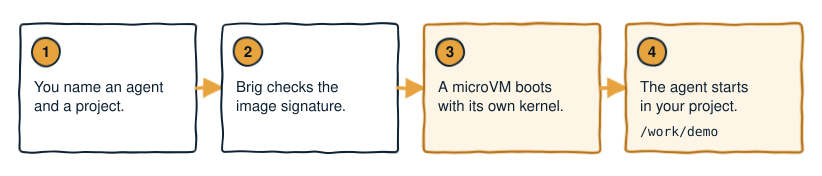

# Quickstart

Start Claude Code inside a sandbox on a throwaway project, see what each step
prints, and remove the sandbox at the end.

The examples are from macOS. The same commands work on Linux, where the
paths and the runtime named in the output differ. After a node-wide Linux
install, run each command as root (`sudo brig ...`).

<p align="center">
  
</p>

## Prerequisites

- Brig, installed on a supported host. See [Install Brig](install.md) and
  [Platform support](install.md#platform-support).
- An Anthropic account, to log Claude Code in.

On macOS 14, set the two variables in
[Platform support](install.md#platform-support) before you run an agent.

> [!TIP]
> To follow the steps without an Anthropic account, use `ubuntu` wherever a
> step says `claude`. That agent is a plain root shell and needs no login.
> brig-sh does not publish its image, so Brig prints a note that there is no
> signature to check. The summary line then reads
> `brig: boot assets verified`.

## Check what Brig found

```bash
brig doctor
```

Brig prints one line per check, in this shape:

```
  ok  brig      v0.3.0 (91b0c7b, 2026-09-26, go1.26.1, darwin/arm64)
  ok  host      macOS 26.5 on arm64
  ok  virtual   Hypervisor.framework available
  ok  runtime   hull <version> at /opt/homebrew/bin/hull
  !!  boot      assets missing at /Users/you/.hull/store/assets
          run any agent once to fetch them, or set BRIG_BOOT_ASSETS to a directory that has them
  ok  verify    cosign at /opt/homebrew/bin/cosign, BRIG_VERIFY=warn
  ok  profiles  8 built in, 0 in /Users/you/.config/brig
  ok  secrets   keychain reachable
  --  brigd     not running (no socket at /Users/you/.brig/brigd.sock)
  --  image     pass an agent to check its image: brig doctor claude
```

| Mark | Meaning |
| --- | --- |
| `ok` | Brig found what that line checks. |
| `!!` | A check failed, and the fix is printed under it. |
| `--` | There is nothing to report. It is not a failure. |

The `boot` line in the example does not stop you. Brig fetches missing boot
assets the first time an agent needs them.

`virtual` reports whether this Mac can host a microVM. It does not say which
backend a run uses. `brigd` is an optional daemon that the steps here do not
need.

## Run it

```bash
mkdir -p ~/code/demo
brig run claude ~/code/demo
```

`claude` is the default session of the `claude-code` agent. `~/code/demo`
is the project this run mounts.

The first run downloads two things: the guest image, and the boot assets
(the kernel and the initrd). Brig caches both, so later runs start faster.

| Where the run prints | What each download shows |
| --- | --- |
| A terminal | A spinner |
| Redirected stderr, a background run, or `TERM=dumb` | One line when the download starts and another when it completes |

A download that fails prints the error. With nerdctl on Linux, Brig announces
only the boot assets, because nerdctl pulls the image itself.

Brig then prints the notes that you can act on. On a first run, a note says
that the guest home is temporary. On macOS, Brig also lists each secret the
agent runs without. Neither stops the run.

After Brig verifies the image and the boot assets, it prints one line and
starts the sandbox:

```
brig: image and boot assets verified
```

On macOS, hull can ask one question about telemetry before the agent
appears. See [Telemetry](telemetry.md) for what it counts and how to turn it
off.

Claude Code then asks you to log in, because the sandbox holds no login for
it. The login happens inside the sandbox. `claude-code` stores it on a
memory-backed mount, so `brig stop` discards it and the next run asks again.
Other agents keep their login on disk. See
[What survives](sessions.md#what-survives) for which ones. To reuse a login
from the host, see [Authentication](authentication.md).

## Check that it worked

The agent's prompt appears, and inside it `pwd` prints `/work/demo`. The
sandbox keeps running after the agent exits, so a second `brig run claude`
starts at once. `brig ls` lists it:

```
REF         SANDBOX          STATE      WORKSPACE
claude-code brig-claude-code running    /Users/you/.brig/homes/brig-claude-code
```

On Linux, `STATE` is the wording of nerdctl, such as `Up`.

## See what a run was given

The execution envelope is the summary of what a sandbox gets: its image, its
mounts, its network and its credentials. `brig info claude` prints it
without booting anything. `brig --verbose run` prints it before the boot:

```
PROFILE      claude-code
SANDBOX      brig-claude-code (hull)
ISOLATION    microVM (hull, hvi backend)
WORKSPACE    /Users/you/.brig/homes/brig-claude-code (read-write)
IMAGE        ghcr.io/brig-sh/claude-code-stock:root (pull missing)
VERIFY       warn, against brig's own trust policy
CREDENTIALS  IS_SANDBOX
NETWORK      isolated (a network of this sandbox's own)
```

| Row | What it tells you |
| --- | --- |
| `ISOLATION` | Names the `hvi` backend because `claude-code` asks for it. `hvi` drives Apple's Hypervisor.framework directly. |
| `WORKSPACE` | The CLI's label for the guest home. |
| `CREDENTIALS` | Every variable and secret the run forwards, by name. `IS_SANDBOX` is a plain marker the profile sets, with no secret in it. |
| `NETWORK` | `isolated` for a new sandbox. The sandbox is kept off the networks of other sandboxes and can still reach the internet. |

The example is from a host with no `GH_TOKEN` exported and no stored secret.
With either one, the `CREDENTIALS` row names it too.

A session created by an older release can report `shared` in the `NETWORK`
row, because an existing session keeps the network it already has.

## Where the agent's files live

The sandbox can reach two host directories, and nothing else on the host:

- The **guest home**, `~/.brig/homes/brig-claude-code`, mounted as the
  agent's home. The agent's settings and history live there.
- The **project**, `~/code/demo` in this run, mounted read-write at
  `/work/demo`. The agent starts there.

The agent works on your real files in the project, so it can change anything
under `/work/demo`. It cannot reach your keychain, your SSH agent, or any
host directory you did not name.

[Sessions, homes and projects](sessions.md) explains what a session is, what
each mount keeps separate, and how to keep a guest home.

## Stop it and clean up

```bash
brig stop claude   # stop the sandbox, keep the session
brig rm claude     # stop the sandbox and remove the session
```

`brig rm` also deletes the guest home, `~/.brig/homes/brig-claude-code`.
Neither command touches `~/code/demo`. Delete it yourself if you no longer
want it.

[What survives](sessions.md#what-survives) lists what each command keeps.

## Next steps

- [Authentication](authentication.md): log an agent in, or give it Git
  access.
- [Sessions, homes and projects](sessions.md): run several sessions, and keep
  a guest home.
- [Policies](policies.md): restrict what the guest can reach.
- [Troubleshooting](troubleshooting.md): organized by what you saw on the
  terminal.
