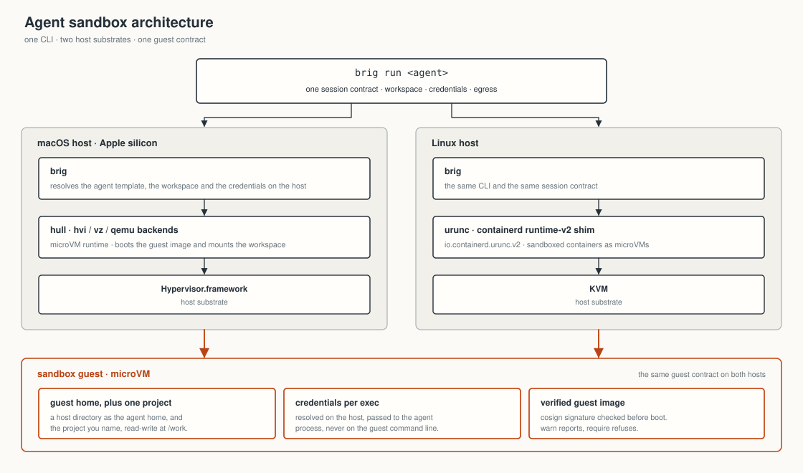

# The runtimes Brig drives

Brig boots a sandbox through a runtime: `hull` on macOS, `nerdctl` on Linux.
See [A container runtime or a VMM](non-goals.md#a-container-runtime-or-a-vmm)
for the reason.

`hull` and `nerdctl` are runtimes. Under hull, `vz`, `hvi` and `qemu` are
hypervisor backends, or backends for short.

| platform | what you adopt |
| --- | --- |
| macOS | Brig and hull |
| Linux | Brig, plus three projects that Brig does not own: nerdctl, containerd and urunc |

On Linux, `install.sh` installs those three projects from the bundle that
[Linux install](install.md#linux) describes. The nerdctl and containerd in
that bundle are upstream releases. Its urunc is built from a branch. See
[What Brig requires of each](#what-brig-requires-of-each).

## What you are installing

The license column comes from the `LICENSE` file of each repository, read on
2026-08-26. Nobody checked the licenses again after that date.

| component | what it does | where it comes from | license |
| --- | --- | --- | --- |
| `brig`, `brigd` | resolves the profile, the guest home and the credentials, then drives the runtime | this repository | Apache-2.0 |
| `hull` | CLI that pulls an OCI image and boots it as a microVM on Apple Silicon | [brig-sh/hull](https://github.com/brig-sh/hull) | Apache-2.0 |
| `vz-runner` | Swift helper hull launches for its `vz` backend, which is what talks to Virtualization.framework | same repository as hull, installed beside it | Apache-2.0 |
| `hvi` | separate microVM monitor for hull's `hvi` backend, which talks to Hypervisor.framework directly | [brig-sh/hvi-vmm](https://github.com/brig-sh/hvi-vmm), a git submodule of hull, installed beside hull | Apache-2.0 |
| `nerdctl` | Docker-compatible CLI for containerd, the binary Brig drives on Linux | [containerd/nerdctl](https://github.com/containerd/nerdctl) | Apache-2.0 |
| `containerd` | daemon underneath nerdctl: it holds the image store and hands each container to a shim | [containerd/containerd](https://github.com/containerd/containerd) | Apache-2.0 |
| `urunc` | the containerd shim `io.containerd.urunc.v2`, which boots the container as a microVM instead of a process | [urunc-dev/urunc](https://github.com/urunc-dev/urunc), built by the Linux runtime bundle from the `feat/unchanged_containers-exec-fixes` branch | Apache-2.0 |
| `cosign` | verifies the signature on a guest image before it boots. Optional, and verification degrades to a warning without it | [sigstore/cosign](https://github.com/sigstore/cosign) | Apache-2.0 |
| `oras` | pulls the boot bundle on Linux for a `genericBoot` profile. Optional otherwise | [oras-project/oras](https://github.com/oras-project/oras) | Apache-2.0 |
| boot bundle | the kernel, `container-initrd` and the in-guest agent that let Brig exec into an image built as an ordinary container. Published as an OCI artifact at `ghcr.io/nofireai/hull-assets`, one tag per guest platform | fetched by hull on macOS. On Linux the runtime bundle carries its own kernel and initrd, and oras fetches this one only on a host without that bundle | unconfirmed: signed with keyless cosign, but the repository that builds it is not public and states no license |

The organization that publishes Brig also publishes hull. hull also works as
a runtime without Brig, with its own command surface. nerdctl, containerd and
urunc are older than Brig and have many users outside it. Brig calls all
three with flags that any other caller can pass.

## Run paths compared

A run path is a runtime with one backend. hull accepts three values for its
`--hypervisor` flag: `vz`, `hvi` and `qemu`. Brig passes the backend that the
profile names, or `BRIG_HYPERVISOR` when that variable is set. Brig always
passes `--hypervisor`, so the default of hull never decides the backend.

| run path | how it reaches the hypervisor | when Brig uses it | graphical console (`kind: gui`) | `--network isolated` |
| --- | --- | --- | --- | --- |
| hull on `vz` | Virtualization.framework, through the `vz-runner` helper | macOS, when neither the profile nor `BRIG_HYPERVISOR` names a backend | yes. It is the only backend that can show a graphical console | refused |
| hull on `hvi` | Hypervisor.framework directly, through the `hvi` microVM monitor | macOS, when the profile or `BRIG_HYPERVISOR` names it | refused | yes. It is the only backend that runs a network gateway of its own |
| hull on `qemu` | see the hull documentation. The source of Brig does not say which framework `qemu` uses, or what it needs on the host | macOS, when the profile or `BRIG_HYPERVISOR` names it | refused | refused |
| nerdctl with urunc | the containerd shim `io.containerd.urunc.v2`, which boots the container as a microVM | Linux | refused | yes. Brig creates a network for each sandbox |

The eight shipped profiles divide as follows on macOS:

| profiles | backend | network |
| --- | --- | --- |
| six of the eight | `hypervisor: hvi` | `network: isolated`, so each new sandbox has a network of its own |
| `claude-desktop` | none named, so `vz` | `shared` |
| `cursor` | none named, so `vz` | none named, so `shared` |

A profile with no network choice falls back to `shared` on `vz` or `qemu`.
The `NETWORK` row in `brig info` names the reason. `vz` and `qemu` still
refuse an explicit `isolated`.

The `Hypervisor.framework available` line in `brig doctor` reports on none of
the three backends. It comes from one read of the `kern.hv_support` sysctl,
which says only whether this Mac can run a microVM. That line never changes
the exit status.

### Egress policy answers

Before a run that carries an egress policy, each run path answers one
question: does it enforce the policy. The answer is `enforced`,
`cannot enforce` or `unknown`. It comes from one table, shown in
[Where a policy is enforced and where it is not](policies.md#where-a-policy-is-enforced-and-where-it-is-not).

| run path | answer | condition |
| --- | --- | --- |
| hull on `hvi` | `enforced` | `network-gateway --help` exits zero within 30 seconds and lists `--egress-default` |
| hull on `hvi` | `cannot enforce` | the gateway does not take `--egress-default`, so it cannot apply the rules |
| hull on `hvi` | `unknown` | the probe fails: the binary does not run, it exits non-zero, or it gives no answer within 30 seconds |
| nerdctl on any shim | `enforced` | `nft list tables` runs in the network namespace that holds its bridges. Brig enters that namespace with `nsenter` when nerdctl is rootless |
| hull on `vz` or `qemu` | `cannot enforce` | no probe runs |
| docker on any shim | `cannot enforce` | no probe runs |
| hull on a backend that the policies table does not name | `unknown` | |

Brig boots a policy-bound run only on `enforced`. The refusal names the
property, the runtime and the backend, and Brig exits `7`. A sandbox with no
policy runs no probe.

## Where the boundary sits

<p align="center">
  
</p>

Brig decides the following, and the runtime never sees the reasons:

- which image, and whether its signature verified (`internal/verify`)
- which host directory is the guest home
- which credentials are resolved, which are denied for billing safety, and
  which are handed in by name and not by value
- the sandbox name, memory, CPU count, network mode, pull policy, root
  filesystem type, hypervisor backend and shared directories
- on macOS, the kernel and initrd paths for an image that carries no kernel,
  and the gateway address each sandbox takes

The runtime decides the mechanical parts:

- how it pulls and stores the image
- how it configures and boots the sandbox
- how a command gets into the guest
- what a stopped instance means

Brig links no runtime code. Every interaction with a runtime is a subprocess.
The same rule applies to `cosign` and `oras`. Brig has four direct Go
dependencies:

- `sigs.k8s.io/yaml` for the profiles
- `golang.org/x/sys` for the terminal and process calls
- `github.com/godbus/dbus/v5` for the Linux secret store
- `github.com/brig-sh/hull/pkg/telemetry` for telemetry: the client hull
  sends through, so the two share one answer. It is a module of its own,
  apart from hull's runtime code, and depends on `golang.org/x/sys` alone

## Every command Brig runs

On macOS, from `internal/runtime/hull.go` unless another file is named:

```
hull --version                          # does this hull boot a digest? (0.1.0-rc23 and later)
hull assets pull [--force]              # HULL_BOOT_ASSETS=<dir> in the environment
hull assets dir
hull ps
hull ps -a                              # falls back to `hull ps` if -a is refused
hull inspect <name>                     # does this sandbox exist, stopped or running?
                                        # and its network: networkinspect.go
hull run --detach --name <name>
     --hypervisor <vz|hvi|qemu> --net <shared|none>   # none is --network offline
     --pull <missing|always|never> --mem <MB> --cpus <n>
     [--rootfs-type <block|virtiofs|9pfs>]
     [--annotation com.urunc.unikernel.bootKernel=<path>]
     [--annotation com.urunc.unikernel.bootInitrd=<path>]
     [--gateway-sock <path> --gateway-cidr <cidr>]
     [--shared-dir <host>:<guest>[:ro]]...
     [--gui [--gui-title <title>]]
     [--env <NAME>|<NAME>=<value>]... <image>
hull exec [-t] [--cwd <dir>] [-u <user>] [--env <NAME>|<NAME>=<value>]... <name> -- <cmd>...
hull logs [--follow] [--tail <n>] <name>
hull stop <name>
hull rm <name>
hull network-gateway --help             # does this hull enforce a policy? (--egress-default)
hull network-gateway --socket <path> --qemu-socket <path>.qemu   # internal/runtime/gateway.go
     --subnet 198.18.0.0/24 --gateway-ip 198.18.0.1 --api <api socket>
hull network-gateway --socket <path> --qemu-socket <path>.qemu
     --subnet <a /30 of its own> --gateway-ip <first address on it>
     --api <api socket>
     [--egress-default <allow|deny>]                  # an isolated sandbox, or one
     [--egress-allow <rule>]... [--egress-deny <rule>]...   # carrying a policy
```

Every exec goes through `hull exec`. The reachability probe, the captured
read, the credential written over stdin and the terminal handover all build
the same argv (`execArgs`). The handover replaces the Brig process with hull,
so the guest gets a real terminal. `brig logs <ref>` runs `hull logs <name>`.
The error output of Brig names that command when a sandbox does not come up.

Brig takes the gateway subnets from 198.18.0.0/15, the range that RFC 2544
reserves for network benchmarking. The public internet never routes that
range and almost nothing uses it. As a result, a sandbox network is unlikely
to collide with a network that you need to reach. Brig does not use the
sibling 198.19.0.0/16, because OrbStack uses it.

On Linux, from `internal/runtime/nerdctl.go`:

```
nerdctl image inspect --format {{index .RepoDigests 0}} <ref>   # the digest to pin
nerdctl ps --filter name=^<name>$ --format {{.Names}}
nerdctl ps -a --format {{.Names}}\t{{.Status}}
nerdctl inspect --format {{json .}} <name>   # its network: networkinspect.go
nerdctl network ls --format {{.Name}}
nerdctl network create <name>            # --network isolated: a network per sandbox
nerdctl network inspect --mode native <name>   # its bridge, under a policy
nerdctl network rm <name>                # with the sandbox, and by rm --all
nerdctl run --detach --name <name>
     --runtime io.containerd.urunc.v2         # BRIG_CONTAINERD_RUNTIME overrides
     --memory <MB>m --cpus <n>
     [--pull <missing|always|never>]
     [--network none | --network <name>]      # offline, or isolated
     [--publish <addr>:<host port>:<guest port>/<proto>]...
     [--annotation com.urunc.unikernel.bootKernel=<path>]
     [--annotation com.urunc.unikernel.bootInitrd=<path>]
     [--annotation com.urunc.unikernel.hypervisor=cloud-hypervisor]
     [-v <host>:<guest>[:ro]]... [--tmpfs <path>:<options>]...
     [-e <NAME>|<NAME>=<value>]... <image> sleep infinity
nerdctl exec -i [-t] [-w <dir>] [-u <user>] [-e <NAME>|<NAME>=<value>]... <name> <cmd>...
nerdctl logs [--follow] [--tail <n>] <name>
nerdctl stop <name>
nerdctl rm <name>
```

The container runs `sleep infinity`, because a container exits when its
command exits. The sandbox must outlive the exec that used it.
`brig logs <ref>` runs `nerdctl logs <name>`.

Two more tools run on the same paths:

```
oras pull ghcr.io/nofireai/hull-assets:<os>-<arch> --output <dir>
                                                # internal/runtime/bootfetch.go
cosign triangulate <image>                      # internal/verify/verify.go
cosign verify --certificate-identity-regexp <identity>
     --certificate-oidc-issuer <issuer> <image>
cosign verify-blob --certificate <cert> --signature <sig>
     --certificate-identity-regexp <identity>
     --certificate-oidc-issuer <issuer> <file>  # internal/verify/record.go
```

### Telemetry variables

Every runtime command carries `HULL_TELEMETRY_PRODUCT=brig` and
`HULL_TELEMETRY_SUPPRESS=1` in its environment. Brig sends its own command
event, so hull never sends one for a call Brig makes.

For the operations that Brig marks as counted -- a boot, the terminal
handover and a stop -- and only once someone has answered yes, Brig sets
`HULL_TELEMETRY_SUPPRESS=command` instead. It does so only for a hull at
0.1.0-rc31 or later: an older hull reads that value as no suppression, and
counts the command a second time. A hull built from source gets
`HULL_TELEMETRY_SUPPRESS=1`, because its version does not say which it is. hull then sends the start, the
lifetime and the resource use of the sandbox, and nothing else. Brig also
sets `HULL_TELEMETRY_VERSION` to its own version, which those events report.
hull never asks the consent question under Brig.

`DO_NOT_TRACK` and `HULL_TELEMETRY_DISABLED` pass through unchanged and win.
[Telemetry](telemetry.md) describes what each event carries.

### Forwarded values

Forwarded values travel in the environment of the runtime command. Only the
bare variable name goes in argv, so nothing readable in `ps` carries a
secret.

| value | where it travels |
| --- | --- |
| an ordinary value with `BRIG_ENV_ARGV=1` | the command line. Use this for a runtime build that cannot take a bare `--env NAME` |
| a value that Brig resolved for you | the environment, also with `BRIG_ENV_ARGV=1` |
| the `HOME`, `PATH`, `TMPDIR` and `XDG_*` of the guest | the command line, as `--env NAME=value` (`-e NAME=value` for nerdctl), because the runtime reads those names for itself |

See [Not in argv](security.md#not-in-argv).

## How Brig finds the runtime

Brig finds the runtime in this order (`internal/runtime/runtime.go`):

1. `BRIG_RUNTIME` names the runtime, `hull` or `nerdctl`. Brig refuses any
   other value by name. If the variable is unset, the runtime is `hull` on
   macOS and `nerdctl` everywhere else.
2. `BRIG_RUNTIME_BIN` is the executable to run. Brig takes a path as it
   stands, and looks up a bare name on PATH. If the executable is missing or
   not executable, Brig reports that against the variable before anything
   runs.
3. A `runtimeBin` in a profile does the same thing without a variable in each
   shell. `BRIG_RUNTIME_BIN` wins over it. Brig expands a leading `~`. If the
   path is missing or not executable, Brig reports that against the profile
   that named it. `runtimeBin` does no PATH lookup, so Brig refuses a bare
   `docker` there as missing.
4. Otherwise Brig searches PATH: `hull` for the hull runtime, and `nerdctl`
   then `docker` for the other runtime.

If PATH has no `nerdctl` and Brig takes `docker`, Brig says so in one line:
`brig` on stderr, `brigd` in the warnings of the response. To make docker
your choice and remove that line, name `docker` in `BRIG_RUNTIME_BIN`, or its
full path in `runtimeBin`.

`brig info <ref>` prints the runtime that Brig found, as
`runtime hull (/opt/homebrew/bin/hull)`. `brig doctor` reports the version of
the runtime.

Brig asks the runtime few questions about itself:

| question | command |
| --- | --- |
| where do the boot assets live? They are under the store of hull, and a path compiled into Brig can go out of date | `hull assets dir` |
| which sandboxes exist, and in what state? | `ps`, on either runtime |
| which network does a sandbox have? | `inspect`, on either runtime |
| can this hull pin a digest? | `hull --version` |
| does this hull enforce a policy? | `network-gateway --help`. See [Egress policy answers](#egress-policy-answers) |

On an old build, Brig drops one feature at a time:

| build | what Brig does |
| --- | --- |
| a current hull release | hull boots a digest reference from its own store, so Brig pins the image that it verified |
| an older hull that cannot pin a digest | hull boots the tag, and Brig says so |
| a hull with an unreadable `hull --version` answer | Brig pins the image |
| a hull without `assets dir` | Brig falls back to `~/.hull/assets` |
| a runtime without `ps -a` | Brig falls back to the plain listing |
| a gateway that cannot enforce a policy | Brig refuses a run that carries a policy. This is the only refusal |
| a hull too old for a flag that Brig passes | the run fails at that flag, with the message of hull |

## What Brig requires of each

**hull** must accept the verbs and flags in
[Every command Brig runs](#every-command-brig-runs), and three more things:

- A bare `--env NAME`, which takes the value from the environment of hull.
  Without it, the only way to forward a credential is `BRIG_ENV_ARGV=1`,
  which puts values where `ps` can read them. hull must also take
  `--env NAME=value`.
- `exec -u root`. Brig uses it to mount a tmpfs inside a running sandbox.
  Container runtimes get their tmpfs at create time
  (`internal/wrap/secretfiles.go`).
- `network-gateway`, for the `hvi` backend. That backend has no egress of its
  own. Brig starts one gateway for each isolated sandbox, and one shared
  gateway for the sandboxes that request `shared`. Brig also assigns the
  addresses on those networks. Guests on one shared gateway can reach each
  other. See
  [Things Brig does not claim](security.md#things-brig-does-not-claim) for the
  answer per backend.

The six `hvi` profiles also set `genericBoot: true`
(`internal/profile/specs`). As a result, the default macOS path needs the
`hvi` binary beside hull, a working gateway and the boot bundle.
`BRIG_HYPERVISOR=vz` with `BRIG_NETWORK=shared` moves those profiles to `vz`.
That setting overrides the isolation that `vz` cannot provide.

<details><summary>A gateway started by an older Brig</summary>

A gateway that an older Brig started has no API socket, so it cannot publish
a port. The next boot replaces that gateway when no sandbox is on it and no
other boot is starting on it.

</details>

**nerdctl** must carry `--annotation` through to the shim, take `--runtime`,
and honor `-v`, `--tmpfs` and a bare `-e NAME`.

Brig accepts `docker` in place of nerdctl. docker works for an image that
carries its own kernel. docker does not pass annotations to the runtime, so
Brig refuses a `genericBoot` profile on it. Without the annotations, the
sandbox has no kernel to boot.

Under an egress policy, nerdctl must also report the bridge of a sandbox
network in `network inspect --mode native` and take `--dns`. The host must
have `nft` and `nsenter`. Brig probes `nft` in the network namespace that
holds the bridge. Brig starts its own resolver in that namespace, and the
resolver installs the rules. See
[How nerdctl enforces a policy](policies.md#how-nerdctl-enforces-a-policy).

That bridge is the Linux enforcement point. It is the first hop outside the
guest that all of the traffic of the sandbox crosses, and Brig owns it. The
network belongs to the sandbox. The user owns the namespace that the network
lives in, rootless or not. The bridge covers any shim that attaches the
sandbox to it. A filter inside the guest is one that the guest can remove.
The user-mode gateway of hull does not build on Linux.

**urunc** must read `com.urunc.unikernel.bootKernel` and
`com.urunc.unikernel.bootInitrd` from the OCI spec of the container, and boot
the image with them. hull takes the same pair on its command line. Brig also
passes `com.urunc.unikernel.hypervisor=cloud-hypervisor` on every
`genericBoot` run, so urunc must find a `cloud-hypervisor` binary.

> [!WARNING]
> No urunc release reads the pair, v0.8.0 included. On a host that brings its
> own urunc (`BRIG_INSTALL_RUNTIME=0`), use a build from the
> `feat/unchanged_containers-exec-fixes` branch of
> [urunc-dev/urunc](https://github.com/urunc-dev/urunc).

A urunc release ignores both annotations and looks for a `urunc.json` in the
image. A stock image has none, so the sandbox never becomes ready.
`brig doctor` still reports the runtime and the boot assets as `ok`. The
branch implements the pair. The runtime bundle builds its urunc from that
branch, and its `container-initrd` from the same commit.

**containerd** must run with the urunc shim installed.
`BRIG_CONTAINERD_RUNTIME` can point at another microVM shim. Brig refuses a
shim that it knows shares the host kernel: `runc` or `crun`, by name or by
path. [security.md](security.md) explains why a kernel of its own for the
guest is the boundary that Brig provides.

### Versions and pins

The source of Brig pins no version of hull, nerdctl, containerd or urunc, and
verifies no digest of any of them. The pin is on the install path.

| platform | the pin |
| --- | --- |
| macOS | the hull cask in `brig-sh/homebrew-brig` names one release tarball and its sha256. The Brig cask depends on that cask, so `brew install --cask brig` gets the build that the tap names |
| Linux | `RUNTIME_VERSION` in `install.sh` names one release of the runtime bundle |

On macOS, the hull cask is written by hand while hull is in its prerelease
series. Read `Casks/hull.rb` for the build that an install gives you.

On Linux with cosign available, `install.sh` checks the signature on the
`checksums.txt` of that release before it runs the installer of the bundle.
The `pins.env` of the bundle records the urunc commit that it was built from,
and `brig-ctl version` prints that commit.

The boot bundle also has a digest:

| host | how the kernel and initrd arrive | what is verified |
| --- | --- | --- |
| macOS | Brig delegates the whole fetch of the boot bundle to hull | hull verifies the signature with cosign against the publishing workflow before it writes the bundle, and records the digest that it verified |
| Linux with the runtime bundle | the boot bundle is not used. The launcher points `BRIG_BOOT_ASSETS` at the kernel and initrd that the runtime bundle carries | the release of the runtime bundle signs a record of their digests. The installer keeps that record beside them |
| Linux without the runtime bundle | the boot bundle arrives through `oras` | `oras` checks no signature itself. `BRIG_BOOT_ASSETS_REF` is how you pin a version or point at a mirror |

On both platforms, Brig compares the kernel and initrd with the listed
digests before it boots them. The list is in the verified bundle or in that
signed record. See
[The kernel, not only the image](security.md#the-kernel-not-only-the-image).

Brig fetches the boot bundle by the digest whose signature it verified, and
not by the tag:

- hull gets `repo@sha256:...` as `HULL_BOOT_ASSETS_REF`, and oras pulls the
  same reference. A tag that moves between the check and the fetch cannot
  deliver a bundle that nobody checked.
- After an oras fetch by digest, Brig writes a `provenance.json` of the shape
  that hull writes. A later run can then tell an older bundle from a changed
  file.
- `BRIG_BOOT_ASSETS_REF` pins a version of `ghcr.io/nofireai/hull-assets` the
  same way.
- hull refuses a reference in any other repository unless
  `HULL_BOOT_ASSETS_ALLOW_FOREIGN` is set. Brig does not set it.
- With no verified digest and `BRIG_BOOT_ASSETS_REF` unset, Brig drops any
  `HULL_BOOT_ASSETS_REF` from the environment that it gives hull.

## Swapping one out

These swaps need no code:

| swap | how |
| --- | --- |
| a different build of the same runtime | `BRIG_RUNTIME_BIN`, or `runtimeBin` in a profile |
| docker in place of nerdctl | docker is already in the PATH search. Brig refuses a `genericBoot` profile on it |
| a different containerd shim | `BRIG_CONTAINERD_RUNTIME`. Any shim that reads the two boot annotations can replace urunc. Brig refuses `runc` and `crun` |
| a different hypervisor backend under hull | `BRIG_HYPERVISOR`, or `hypervisor:` in a profile |

The `ISOLATION` row of the envelope names the shim that you set. For a shim
that is not urunc and that Brig cannot place, that row calls the boundary
unknown and does not call it a microVM.

A third runtime in place of hull or nerdctl is a code change. Implement the
`Runtime` interface in `internal/runtime/runtime.go`, and add a case to
`DetectFor`. Every runtime implements that interface. A runtime must name
itself and its isolation, list sandboxes, and read the digest of an image. It
must run a sandbox, exec into it in several ways, stop it, remove it, and
show its logs. A replacement
for hull is a program that boots an OCI image as a microVM and can exec into
it. Guest homes, credentials and profiles sit above that interface. They are
written once for both operating systems and do not change.

The rest of what Brig asks of a runtime is in optional interfaces in
`internal/runtime`. Brig checks for each one separately:

- `Exister` and `NetworkInspector`: whether a sandbox exists, and its
  network.
- `RunChecker`: what the backend refuses before a boot, such as a policy it
  cannot enforce. Brig never asks a runtime without it, so it refuses
  nothing there.
- `NetworkChecker`, `NetworkPruner` and `SharedNetworkPruner`: a network
  that went stale, and networks left behind.
- `Publisher`: ports opened on a running sandbox.
- `BootResolver`: the boot assets, fetched before the boot.
- `FeedLimiter` and `FallbackReporter`: a size limit on stdin, and a
  stand-in binary such as docker.

### Shared and Brig-only parts

| shared with | what |
| --- | --- |
| other projects | containerd, nerdctl, urunc, cosign and oras |
| hull | the boot bundle, the on-disk layout it lands in, and the two annotation names. A machine that ran either runtime already has the other one seeded |
| nobody (Brig only) | profiles, the secret store and its provenance records, the credential forwarding rules, the billing denylist, the guest home contract, the image verification policy and `brigd` |

## Building hull from source on macOS

This section is for people who work on hull. To build Brig from source, you
need none of it. Brig holds no entitlement and drives the hull that it finds.

A from-source hull can boot a microVM only when it is signed with an Apple
identity. The helper binaries talk to the hypervisor, and each one needs an
entitlement:

| binary | talks to | entitlement |
| --- | --- | --- |
| `vz-runner` | Virtualization.framework | `com.apple.security.virtualization` |
| `hvi` | Hypervisor.framework | `com.apple.security.hypervisor` |

macOS honors an entitlement only on a binary signed with a real Apple
identity: an Apple Development or Developer ID Application certificate. With
an ad-hoc signature (`codesign --sign -`), macOS honors the entitlement only
with AMFI disabled. To disable AMFI, you must disable SIP and set a boot
argument. A copy of an entitled binary loses its signature, so sign the
binary again after every build and every copy.

The `make macos` target of hull builds and signs all three binaries when you
give it a `CODESIGN_IDENTITY`. The hull README documents the entitlement
plists. The shipped Brig profiles ask for the `hvi` backend, so a from-source
build needs a signed `hvi` binary and a signed `vz-runner`.

The released hull is signed, notarized and stapled. `brew install --cask brig`
gives you a runtime that boots without these steps.
