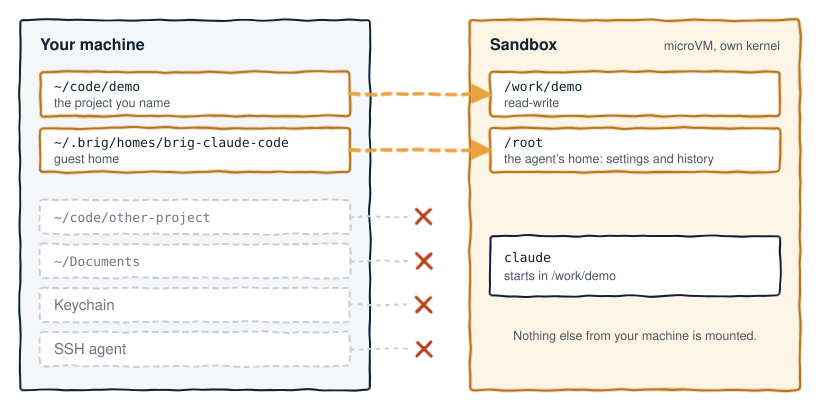

# Sessions, homes and projects

Each session of an agent has its own guest home and its own sandbox. For a
walkthrough, see [Quickstart](quickstart.md).

<p align="center">
  
</p>

## The ref

Every ref is `<agent>` or `<agent>@<label>`. A ref with no label names the
default session of the agent. `claude` and `claude@refactor` are two
independent sessions of one agent.

`claude` and `desktop` are aliases for the built-in agents `claude-code`
and `claude-desktop`. Brig resolves no other alias. An agent wins over an
alias. If you create your own profile named `claude`, that name runs your
profile. The built-in `claude-code` is then reachable only by its full name.

A label selects the guest home and the sandbox name, for every agent. Brig
also passes the label to the agent as its display name in one case:
`brig run` with the resolved profile `claude-code`. `brig sh` does not pass
it. No other profile receives it, `claude-desktop` included.

## The guest home

The guest home is a host directory mounted as the agent's home. `brig ls`
and `brig info` print it as `WORKSPACE`, and the `BRIG_WORKSPACE`
environment variable sets it. Both are the CLI's names for the guest home.

To keep the guest home, name it with `--home <dir>` or `BRIG_WORKSPACE`. If
the run names none, Brig creates one under its own state directory:

```
~/.brig/homes/<sandbox name>
```

The sandbox name is `brig-<resolved agent name>[-<label>]`. The resolved
name is the agent's own name. An alias that you typed does not change it.

| Ref | Guest home |
| --- | --- |
| `claude` | `~/.brig/homes/brig-claude-code` |
| `claude@refactor` | `~/.brig/homes/brig-claude-code-refactor` |

| Guest home | What happens to it |
| --- | --- |
| You named it | Brig never deletes it. It survives every command described here. A named session appends `-<label>` to it. |
| Brig created it | It belongs to the sandbox. It survives `brig stop` and a host reboot, and `brig rm` deletes it. |

After `brig rm` deletes a guest home, the next `brig run` of the same session
starts from an empty home. The first run of a session whose guest home Brig
created says so on stderr.

Brig also deletes a guest home that it created in two other cases. In both,
the runtime first confirms that no sandbox of that name exists, stopped or
running.

- A first run whose boot fails deletes the home it created.
- A home can remain after a sandbox was removed outside Brig, or after a run
  was killed before its sandbox booted. Brig deletes that home before the
  next run of that session boots, and says so on stderr.

<details>
<summary>Sessions from releases before 0.3.0</summary>

Releases before 0.3.0 created the default guest home in
`~/brig/<resolved agent name>[-<label>]`, and kept it on `brig rm`. A session
that one of those releases started keeps that home while its sandbox exists.
After you remove the sandbox, pass `--home ~/brig/<resolved agent name>` to
continue to use that home.

</details>

## The project

Name a directory on the run line:

```bash
brig run claude ~/code/demo
```

Brig mounts `~/code/demo` read-write at `/work/demo`, and the agent starts
there.

| Run line | Project that Brig mounts |
| --- | --- |
| Names a directory | That directory |
| Names no project | The project this session last ran with, read back from its session index |
| `--no-project` | None |

Brig refuses `--no-project` together with a project named on the same line.
Brig also refuses `--no-project` on every verb but `run`.

A mount cannot be attached to a live guest, so a change of project recreates
the sandbox. Brig warns you, stops the running sandbox, removes it, and
starts a new one with the new project mounted. This occurs in three cases:

- You run a session against a different project than it last used.
- You name a project for the first time on a session that had none.
- `--no-project` drops the project that the session had.

The new sandbox keeps nothing from inside the old guest, so a `claude-code`
login held in memory is lost.

If a remembered project no longer exists on disk, the run continues with no
project. The restart warning names the missing directory.

## What survives

Four things can hold state for a session:

- the guest home, on host disk
- a memory-backed mount inside the guest
- the sandbox
- what Brig recorded about the session

Only two of the eight built-in agents, `claude-code` and `claude-desktop`,
declare a memory-backed mount. For the other six, `codex`, `cursor`,
`gemini`, `grok`, `opencode` and `ubuntu`, the whole guest home is the
host-backed share. An in-guest login for those six agents lands on host disk
and survives every stop. `brig rm` deletes it when Brig created the guest
home.

| Event | Guest home | Memory-backed mount (`claude-code`, `claude-desktop`) | The sandbox | What Brig recorded |
| --- | --- | --- | --- | --- |
| The agent exits | kept | kept, the sandbox is still up | still running | unchanged |
| `brig stop` | kept | gone with the sandbox | stopped, still named in `brig ls` | kept |
| `brig rm` | deleted if Brig created it, kept if you named it | gone | removed | dropped |
| `brig rm --all` | as `brig rm`, every session | gone | every sandbox removed | dropped, every session |
| The sandbox is removed outside Brig, then `brig rm` | kept, and the next run of the ref deletes it if Brig created it | gone with the sandbox | already gone, and `rm` exits `3` | dropped |
| A host reboot | kept, an ordinary host directory | gone, guest memory cannot survive a reboot | depends on the runtime | kept as host files |

`brig stop` and `brig rm` do not touch a project.

When the runtime reports no sandbox for the ref, `brig rm` forgets the
session and names the guest home that it leaves.

A host reboot loses everything inside the sandbox, including a `claude-code`
login held in memory. If the runtime no longer lists the sandbox after the
reboot, the next `brig ls` or `brig rm` of its ref forgets it. The next run
then boots a new sandbox.

Brig keeps its own records, the session index among them, under `~/.brig`.
That layout is not a stable interface. Do not script against its files.

## What a label can contain

Brig turns a label into a slug:

- It makes the label lowercase.
- It replaces every character outside `[A-Za-z0-9._-]` with a dash.
- It collapses runs of dashes.
- It trims leading and trailing dots and dashes.

Brig shortens nothing.

The `<agent>@<label>` form is strict. Brig refuses each of these:

- a label that is not already its own slug (Brig names the slug it maps to)
- more than one `@`
- a ref that names no agent
- a trailing `@` with no label
- a label with no usable characters
- a label that names the default session of another agent

The retiring `--name` flag is lenient. It sanitizes the name and warns which
directory it used. For example, `--name "Refactor Sprint"` becomes
`refactor-sprint` with a warning.

## Printing the ref

| Output | The ref it prints | Example |
| --- | --- | --- |
| `brig ls` | The agent's own name plus the label | A session started as `claude@refactor` shows as `claude-code@refactor` |
| The Run object of `run --json` | The ref as typed | `brig --json run claude` reports `"ref": "claude"` |

A script that reads both outputs sees two different strings for the same
session.
